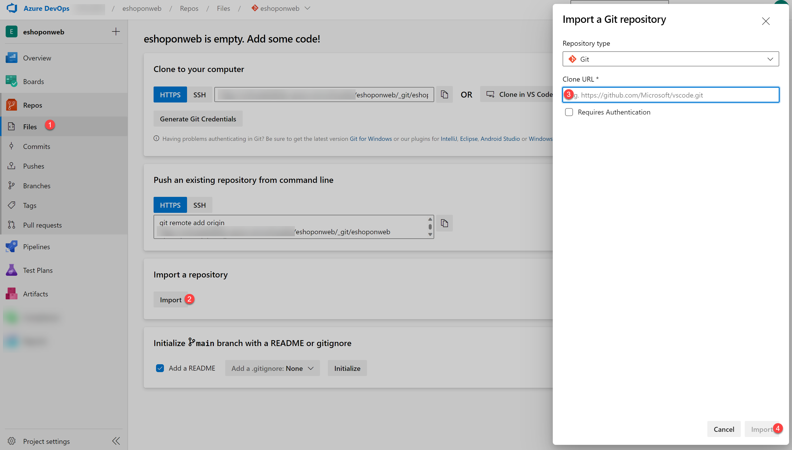

---
lab:
  title: Validación del entorno de laboratorio
  module: 'Module 0: Welcome'
---

# Validación del entorno de laboratorio

En la preparación para los laboratorios, es fundamental tener el entorno configurado correctamente. Esta página le guiará a través del proceso de configuración y garantiza que se cumplen todos los requisitos previos.

- Este laboratorio requiere **Microsoft Edge** o un [explorador compatible con Azure DevOps](https://learn.microsoft.com/azure/devops/server/compatibility?view=azure-devops#web-portal-supported-browsers).

- **Configurar una suscripción de Azure:** si aún no tiene una suscripción de Azure, cree una siguiendo las instrucciones de esta página o visite [https://azure.microsoft.com/free](https://azure.microsoft.com/free) para registrarse de forma gratuita.

- **Configurar una organización de Azure DevOps:**: si aún no tiene una organización Azure DevOps que pueda usar para este laboratorio, cree una siguiendo las instrucciones disponibles en [Creación de una organización o colección de proyectos](https://learn.microsoft.com/azure/devops/organizations/accounts/create-organization).
  
- Página de descarga de [Git para Windows](https://gitforwindows.org/). Esto se instalará como parte de los requisitos previos para este laboratorio.

- [Visual Studio Code](https://code.visualstudio.com/). Esto se instalará como parte de los requisitos previos para este laboratorio.

- [Azure CLI](https://learn.microsoft.com/cli/azure/install-azure-cli). Instale la CLI de Azure en las máquinas del agente autohospedado.

- [.NET SDK: la versión más reciente](https://dotnet.microsoft.com/download/visual-studio-sdks). Instala el SDK .NET en las máquinas de los agentes autohospedados.

## Instrucciones para crear una organización de Azure DevOps (solo tiene que hacerlo una vez)

> **Nota**: Comience en el paso 3 si ya tiene **cuenta de Microsoft** configurada y una suscripción activa de Azure vinculada a esa cuenta.

1. Use una sesión privada del explorador para obtener una nueva **cuenta de Microsoft (MSA) personal** en `https://account.microsoft.com`.

1. Con la misma sesión del explorador, regístrese para obtener una suscripción gratuita de Azure en `https://azure.microsoft.com/free`.

1. Abra un explorador y vaya a Azure Portal en `https://portal.azure.com` y busque **Azure DevOps** en la parte superior de la pantalla de Azure Portal. En la página que aparece, haga clic en **Organizaciones de Azure DevOps**.

1. Después haz clic en el enlace con la etiqueta **My Azure DevOps Organizations ** o ve directamente a `https://aex.dev.azure.com`.

1. En la página **Necesitamos más detalles**, seleccione **Continuar**.

1. En el cuadro desplegable de la izquierda, seleccione **Directorio predeterminado**, en lugar de **Cuenta de Microsoft**.

1. Si se le solicita (*“Necesitamos más detalles”),* proporcione su nombre, dirección de correo electrónico y ubicación, y haga clic en **Continuar**.

1. De nuevo en `https://aex.dev.azure.com` con **el directorio predeterminado** seleccionado, haz clic en el botón azul **Crear nueva organización.**

1. Acepta los *Términos de servicio* haciendo clic en **Continuar**.

1. Si aparece un mensaje (*“Casi listo”),* deje el nombre de la organización de Azure DevOps de forma predeterminada (debe ser un nombre único global) y elija una ubicación de hospedaje cercana a usted en la lista.

1. Una vez que se abra la organización recién creada en **Azure DevOps**, seleccione **Configuración de la organización** en la esquina inferior izquierda.

1. En la pantalla **Configuración de la organización**, seleccione **Facturación** (abrir esta pantalla tarda unos segundos).

1. Seleccione **Configurar facturación** y, en el lado derecho de la pantalla, seleccione la **suscripción de Azure** y, a continuación, seleccione **Guardar** para vincular la suscripción con la organización.

1. Una vez que la pantalla muestre el identificador de suscripción de Azure vinculado en la parte superior, cambie el número de **trabajos paralelos de pago** de **CI/CD hospedados de MS** de 0 a **1**. Después, haga clic en el botón **Guardar** de la parte inferior.

   > **Nota**: puedes **esperar un par de minutos antes de usar las funcionalidades de CI/CD** para que la nueva configuración se refleje en el backend. De lo contrario, verá el mensaje *“No se ha comprado o concedido ningún paralelismo hospedado”.*

1. En **Organización Configuración**, ve a la sección **Canalizaciones** y haz clic en **Configuración**.

1. Pulsa el botón a**Desactivar** para **Deshabilitar la creación de canalizaciones de compilación clásicas** y **Deshabilitar la creación de canalizaciones de versión clásicas**.

   > **Nota**: El interruptor **Deshabilitar la creación de canalizaciones de versión clásicas** establecido en **Activado** oculta las opciones de creación de canalizaciones de versión clásicas como el menú **Versión** de la sección **Canalización** de proyectos DevOps.

1. En **Organización Configuración**, ve a la sección **Seguridad** y haz clic en **Directivas**.

1. Cambie el interruptor a **Activado** para **permitir proyectos públicos.**

   > **Nota**: Las extensiones usadas en algunos laboratorios pueden requerir un proyecto público para permitir el uso de la versión gratuita.

## Instrucciones para crear y configurar el proyecto de Azure DevOps (solo tiene que hacerlo una vez)

> **Nota**: Asegúrate de completar los pasos necesarios para crear la organización de Azure DevOps antes de continuar con estos pasos.

Para seguir todas las instrucciones del laboratorio, deberá configurar un nuevo proyecto de Azure DevOps, crear un repositorio basado en la aplicación [eShopOnWeb](https://github.com/MicrosoftLearning/eShopOnWeb) y crear una conexión de servicio a la suscripción de Azure.

### Creación del proyecto de equipo

En primer lugar, creará un proyecto **eShopOnWeb** de Azure DevOps que se usará en varios laboratorios.

1. Abra su explorador y navegue a su organización de Azure DevOps.

1. Seleccione la opción **Nuevo proyecto** y use la siguiente configuración:
   - Nombre: **eShopOnWeb**
   - visibilidad: **Privado**
   - Avanzado: Control de versiones: **Git**
   - Avanzado: Proceso de elemento de trabajo: **Scrum**

1. Selecciona **Crear**.

   

### Importación del repositorio Git de eShopOnWeb

Ahora, importarás eShopOnWeb en el repositorio Git.

1. Abre el explorador y ve a tu organización de Azure DevOps.

1. Abre el proyecto **eShopOnWeb** creado anteriormente.

1. Selecciona **Repositorios > Archivos**, **Importar un repositorio** y, después, selecciona **Importar**.

1. En la ventana **Importar un repositorio Git**, pega la siguiente dirección URL `https://github.com/MicrosoftLearning/eShopOnWeb` y selecciona **Importar**:

   

1. El repositorio se organiza de la siguiente manera:

   - La carpeta **.ado** contiene canalizaciones de YAML de Azure DevOps.
   - El contenedor de carpetas **.devcontainer** está configurado para realizar el desarrollo con contenedores (ya sea localmente en VS Code o GitHub Codespaces).
   - La carpeta **.azure** contiene infraestructura de la plantilla de ARM y Bicep como plantillas de código.
   - Definiciones de flujo de trabajo de GitHub del contenedor de carpetas **.github**.
   - La carpeta **src** contiene el sitio web de .NET 8 que se usa en los escenarios de laboratorio.

1. Deja abierta la ventana del explorador web.  

1. Ve a **Repos > Ramas**.

1. Mantén el puntero sobre la rama **main** y haz clic en los puntos suspensivos a la derecha de la columna.

1. Haz clic en **Establecer como rama predeterminada**.

### Creación de una conexión de servicio para acceder a los recursos de Azure

A continuación, crearás una conexión de servicio en Azure DevOps que te permitirá implementar y acceder a los recursos de tu suscripción a Azure.

1. Vuelve al explorador web, ve al portal de Azure DevOps con el proyecto **eShopOnWeb** abierto y selecciona **Configuración del proyecto** en la esquina inferior izquierda del portal.

1. En Canalizaciones, selecciona **Conexiones de servicio** y, después, selecciona el botón **Crear conexión de servicio**.

   

1. En la hoja **Nueva conexión de servicio**, selecciona **Azure Resource Manager** y, después, selecciona **Siguiente** (es posible que debas desplazarte hacia abajo).

1. Selecciona **Federación de identidades de carga de trabajo (automática)** y **Siguiente**.

   > **Nota**: también puedes usar **Federación de identidades de carga de trabajo (manual)** si prefieres configurar manualmente la conexión de servicio. Sigue los pasos de la [Documentación de Azure DevOps](https://learn.microsoft.com/azure/devops/pipelines/library/connect-to-azure) para crear una conexión de servicio manualmente.

1. Rellena los campos vacíos con la información:
    - **Suscripción**: selecciona tu suscripción a Azure.
    - **Grupo de recursos**: selecciona el grupo de recursos en el que deseas implementar los recursos.
    - **Nombre de conexión del servicio**: tipo **`azure subs`**. Se hará referencia a este nombre en las canalizaciones YAML para acceder a tu suscripción de Azure.

1. Asegúrate de que la opción **Conceder permiso de acceso a todas las canalizaciones** está desactivada y selecciona **Guardar**.

   > **Nota:** la opción **Conceder permiso de acceso a todas las canalizaciones** no se recomienda para entornos de producción. Solo se usa en este laboratorio para simplificar la configuración de la canalización.

   > **Nota**: si ves un mensaje de error que indica que no tienes los permisos necesarios para crear una conexión de servicio, inténtalo de nuevo o configura la conexión de servicio manualmente.

Ya has completado los pasos previos necesarios para continuar con los laboratorios.
