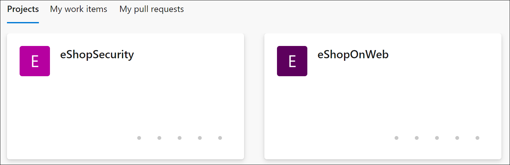
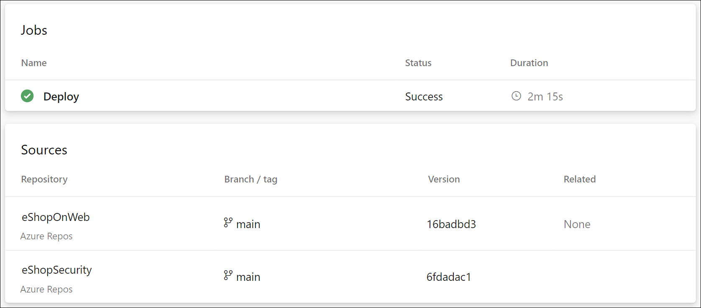

---
lab:
  title: Configuración de una estructura de proyecto y repositorio para admitir canalizaciones seguras
  module: 'Module 1: Configure a project and repository structure to support secure pipelines'
---

# Configuración de una estructura de proyecto y repositorio para admitir canalizaciones seguras

En este laboratorio, aprenderás a configurar una estructura de proyecto y repositorio en Azure DevOps para admitir canalizaciones seguras. En este laboratorio se tratan los procedimientos recomendados para organizar proyectos y repositorios, asignar permisos y administrar archivos seguros.

Estos ejercicios duran aproximadamente **30** minutos.

## Antes de comenzar

Necesitarás una suscripción a Azure, una organización de Azure DevOps y la aplicación eShopOnWeb para seguir los laboratorios.

- Sigue los pasos para [validar el entorno de laboratorio](APL2001_M00_Validate_Lab_Environment.md).

## Instrucciones

### Ejercicio 1: Configuración de una estructura de proyecto segura

En este ejercicio, configurarás una estructura de proyecto segura mediante la creación de un nuevo proyecto y la asignación de permisos de proyecto. La separación de responsabilidades y recursos en diferentes proyectos o repositorios con permisos específicos complementa la seguridad.

#### Tarea 1: Creación de un nuevo proyecto de equipo

1. Ve al portal de Azure DevOps en `https://aex.dev.azure.com` y abre tu organización.

1. Abre la **configuración de la organización** en la esquina inferior izquierda del portal y, después, abre **Proyectos** en la sección General.

1. Selecciona la opción **Nuevo proyecto** y usa la siguiente configuración:

   - Nombre: **eShopSecurity**
   - Visibilidad: **Privado**
   - Avanzado: Control de versiones: **Git**
   - Avanzado: Proceso de elemento de trabajo: **Scrum**

   

1. Haz clic en **Crear** para crear el proyecto.

1. Ahora puedes cambiar entre los diferentes proyectos haciendo clic en el icono de Azure DevOps de la esquina superior izquierda del portal de Azure DevOps.

   

Puedes administrar los permisos y la configuración de cada proyecto de equipo por separado. Para ello, ve al menú Configuración del proyecto y selecciona el proyecto de equipo adecuado. Si tienes varios usuarios o equipos que trabajan en proyectos diferentes, también puedes asignar permisos a cada proyecto por separado.

#### Tarea 2: Creación de un nuevo repositorio y asignar permisos de proyecto

1. Selecciona el nombre de la organización en la esquina superior izquierda del portal de Azure DevOps y selecciona el nuevo proyecto **eShopSecurity**.

1. Selecciona el menú **Repositorios**.

1. Selecciona el botón **Inicializar** para inicializar el nuevo repositorio agregando el archivo README.md.

1. Abre el menú **Configuración del proyecto** en la esquina inferior izquierda del portal y selecciona **Repositorios** en la sección Repositorios.

1. Selecciona el nuevo repositorio de **eShopSecurity** y selecciona la pestaña **Seguridad**.

   > **Nota**: asegúrate de seleccionar la pestaña Seguridad solo en el repositorio específico y no para todos los repositorios del proyecto. Si seleccionas todos los repositorios, puedes perder el acceso a otros repositorios del proyecto.

1. Quita los permisos Heredar del elemento primario desactivando el botón de alternancia **Herencia**.

1. Selecciona el grupo **Colaboradores** y selecciona el elemento desplegable **Denegar** para todos los permisos excepto **Administrar permisos** y **Leer**. Esto impedirá que todos los usuarios del grupo Colaboradores accedan al repositorio.

   > **Nota**: en una situación real, también denegarás los permisos de administración al grupo Colaboradores. En este laboratorio, estamos permitiendo que el grupo Colaboradores administre permisos para que puedas completar el laboratorio.

1. Selecciona el usuario en Usuarios y selecciona el botón **Permitir** para permitir todos los permisos.

   > **Nota**: si no ves tu nombre en la sección **Usuarios**, escríbelo en el cuadro de texto **Buscar usuarios o grupos** y selecciónalo en la lista de resultados.

   

1. Los cambios se guardarán automáticamente.

Ahora solo el usuario al que asignaste permisos y los administradores pueden acceder al repositorio. Esto resulta útil cuando deseas permitir que usuarios específicos accedan al repositorio y ejecuten canalizaciones desde el proyecto eShopOnWeb.

### Ejercicio 2: Configuración de una canalización y una estructura de plantilla para admitir canalizaciones seguras

#### Tarea 1: importación y ejecución de la canalización de CI

Empecemos importando la canalización de CI denominada [eshoponweb-ci.yml](https://github.com/MicrosoftLearning/eShopOnWeb/blob/main/.ado/eshoponweb-ci.yml).

1. Ve al portal de Azure DevOps en `https://aex.dev.azure.com` y abre tu organización.

1. Abre el proyecto **eShopOnWeb** en Azure DevOps.

1. Ve a **Canalizaciones > Canalizaciones**.

1. Selecciona el botón **Crear canalización**.

1. Selecciona **Git de Azure Repos (YAML)**.

1. Selecciona el repositorio **eShopOnWeb**.

1. Selecciona **Archivo YAML de Azure Pipelines existente**.

1. Selecciona el archivo **/.ado/eshoponweb-ci.yml** y haz clic en **Continuar**.

1. Haz clic en el botón **Ejecutar** para ejecutar la canalización.

   > **Nota**: la canalización adoptará un nombre en función del nombre del proyecto. Cambiarás el nombre para identificar la canalización con más facilidad.

1. Ve a **Canalizaciones > Canalizaciones** y selecciona la canalización creada recientemente. Selecciona los puntos suspensivos (...) y, a continuación, selecciona la opción **Cambiar nombre/mover**.

1. Asígnale el nombre **eshoponweb-ci** y selecciona **Guardar**.

#### Tarea 2: Importación y ejecución de la canalización de CD

> **Nota**: en esta tarea, importarás y ejecutarás la canalización de CD denominada [eshoponweb-cd-webapp-code.yml](https://github.com/MicrosoftLearning/eShopOnWeb/blob/main/.ado/eshoponweb-cd-webapp-code.yml).

1. Ve a **Canalizaciones > Canalizaciones**.

1. Selecciona el botón **Nueva canalización**.

1. Selecciona **Git de Azure Repos (YAML)**.

1. Selecciona el repositorio **eShopOnWeb**.

1. Selecciona **Archivo YAML de Azure Pipelines existente**.

1. Selecciona el archivo **/.ado/eshoponweb-cd-webapp-code.yml** y, después, selecciona **Continuar**.

1. En la definición de canalización de YAML, establece la sección variables de la siguiente manera:

   ```yaml
   variables:
     resource-group: 'YOUR-RESOURCE-GROUP-NAME'
     location: 'centralus'
     templateFile: 'infra/webapp.bicep'
     subscriptionid: 'YOUR-SUBSCRIPTION-ID'
     azureserviceconnection: 'YOUR-AZURE-SERVICE-CONNECTION-NAME'
     webappname: 'YOUR-WEB-APP-NAME'
   ```

1. Reemplaza los valores de las variables por los valores correctos de tu entorno:

   - Reemplaza **YOUR-RESOURCE-GROUP-NAME** por el nombre del grupo de recursos que deseas usar en este laboratorio, por ejemplo, **rg-eshoponweb-multi**.
   - Establece el valor de la variable **location** en el nombre de la región de Azure en la que quieres implementar los recursos, por ejemplo, **centralus**.
   - Reemplaza **YOUR-SUBSCRIPTION-ID** por tu identificador de suscripción a Azure.
   - Reemplaza **YOUR-AZURE-SERVICE-CONNECTION-NAME** por **azure subs**
   - Reemplaza **YOUR-WEB-APP-NAME** por un nombre único global de la aplicación web que se va a implementar, por ejemplo, la cadena **eshoponweb-lab-multi-123456** seguida de un número aleatorio de seis dígitos.

1. Selecciona **Guardar y ejecutar** y elige hacer "commit" directamente en la rama principal.

1. Selecciona **Guardar y ejecutar** de nuevo.

1. Abre la ejecución de la canalización. Si ves el mensaje “Esta canalización necesita permiso para acceder a un recurso antes de que esta ejecución pueda continuar con Implementar en WebApp”, selecciona **Ver**, **Permitir** y **Permitir** de nuevo. Esto es necesario para permitir que la canalización cree el recurso de Azure App Service.

   

1. La implementación puede tardar unos minutos en completarse, espera a que se ejecute la canalización. La canalización se desencadena después de la finalización de la canalización de CI e incluye las siguientes tareas:

   - **AzureResourceManagerTemplateDeployment**: Implementa la aplicación web de Azure App Service mediante una plantilla de Bicep.
   - **AzureRmWebAppDeployment**: Publica el sitio web en la aplicación web de Azure App Service.

   > **Nota**: en caso de que se produzca un error en la implementación, ve a la página de ejecución de la canalización y selecciona **Volver a ejecutar trabajos con errores** para invocar otra ejecución de canalización.

   > **Nota**: la canalización adoptará un nombre en función del nombre del proyecto. Vamos a **cambiarle el nombre** para identificar mejor la canalización.

1. Ve a **Canalizaciones > Canalizaciones** y selecciona la canalización creada recientemente. Selecciona los puntos suspensivos (...) y, a continuación, selecciona la opción **Cambiar nombre/mover**.

1. Asígnale el nombre **eshoponweb-cd-webapp-code** y haz clic en **Guardar**.

Ahora deberías tener dos canalizaciones que se ejecutan en el proyecto eShopOnWeb.


#### Tarea 3: Movimiento de las variables de la canalización de CD a una plantilla de YAML

En esta tarea, crearás una plantilla de YAML para almacenar las variables usadas en la canalización de CD. Esto te permitirá reutilizar la plantilla en otras canalizaciones.

1. Ve a **Repositorios** y, después, a **Archivos**.

1. Expande la carpeta **.ado** y selecciona **Nuevo archivo**.

1. Asigna al archivo el nombre **eshoponweb-secure-variables.yml** y selecciona **Crear**.

1. Agrega la sección variables que se usa en la canalización de CD al nuevo archivo. El archivo debería tener este aspecto:

   ```yaml
   variables:
     resource-group: 'rg-eshoponweb-secure'
     location: 'southcentralus' #the name of the Azure region you want to deploy your resources
     templateFile: 'infra/webapp.bicep'
     subscriptionid: 'YOUR-SUBSCRIPTION-ID'
     azureserviceconnection: 'azure subs' #the name of the service connection to your Azure subscription
     webappname: 'eshoponweb-lab-secure-XXXXXX' #the globally unique name of the web app
   ```

   > **Importante**: reemplaza los valores de las variables por los valores del entorno (grupo de recursos, ubicación, identificador de suscripción, conexión de servicio de Azure y nombre de la aplicación web).

1. Selecciona **Commit**, en el cuadro de texto de hacer "commit", escribe `[skip ci]` y, luego, selecciona **Commit**.

   > **Nota**: mediante la adición del comentario `[skip ci]` a hacer "commit", evitarás la ejecución automática de la canalización que, en este momento, se ejecuta de forma predeterminada después de cada cambio en el repositorio.

1. En la lista de archivos del repositorio, abre la definición de canalización de **eshoponweb-cd-webapp-code.yml** y reemplaza la sección variables por lo siguiente:

   ```yaml
   variables:
     - template: eshoponweb-secure-variables.yml
   ```

1. Selecciona **Commit**, acepta el comentario predeterminado y, luego, selecciona **Commit** para volver a ejecutar la canalización.

1. Comprueba que la ejecución de canalización se haya completado correctamente.

Ahora tienes una plantilla de YAML con las variables usadas en la canalización de CD. Puedes reutilizar esta plantilla en otras canalizaciones en escenarios en los que necesites implementar los mismos recursos. Además, el equipo de operaciones puede controlar el grupo de recursos y la ubicación donde se implementan los recursos y otra información de los valores de la plantilla y no es necesario realizar ningún cambio en la definición de la canalización.

#### Tarea 4: Movimiento de las plantillas de YAML a un repositorio y proyecto independientes

En esta tarea, moverás las plantillas de YAML a un repositorio y proyecto independientes.

1. En el proyecto eShopSecurity, ve a **Repositorio > Archivos**.

1. Crea un nuevo archivo denominado **eshoponweb-secure-variables.yml**.

1. Copia el contenido del archivo **.ado/eshoponweb-secure-variables.yml** del repositorio eShopOnWeb al nuevo archivo.

1. Confirma los cambios.

1. Abre la definición de canalización **eshoponweb-cd-webapp-code.yml** en el repositorio eShopOnWeb.

1. Agrega lo siguiente a la sección recursos antes de la sección variables de la definición de canalización:

   ```yaml
     repositories:
       - repository: eShopSecurity
         type: git
         name: eShopSecurity/eShopSecurity #name of the project and repository
   ```

1. Reemplaza la sección variables por el contenido siguiente:

   ```yaml
   variables:
     - template: eshoponweb-secure-variables.yml@eShopSecurity #name of the template and repository
   ```

   

1. Selecciona **Commit**, acepta el comentario predeterminado y, luego, selecciona **Commit** para volver a ejecutar la canalización.

1. Ve a la ejecución de canalización y comprueba que la canalización use el archivo YAML desde el repositorio de eShopSecurity.

   

Ahora tienes el archivo YAML en un repositorio y un proyecto independientes. Puedes reutilizar este archivo en otras canalizaciones en escenarios en los que necesites implementar los mismos recursos. Además, el equipo de operaciones puede controlar el grupo de recursos, la ubicación, la seguridad, dónde se implementan los recursos y otra información modificando los valores en el archivo YAML y no es necesario realizar ningún cambio en la definición de canalización.

> [!IMPORTANT]
> Recuerda eliminar los recursos creados en Azure Portal para evitar cargos innecesarios.

## Revisión

En este laboratorio, has aprendido a configurar una estructura de proyecto y repositorio en Azure DevOps para admitir canalizaciones seguras. Mediante la administración eficaz de los permisos, puedes asegurarte de que los usuarios adecuados tengan acceso a los recursos que necesitan al tiempo que mantienen la seguridad e integridad de las canalizaciones y procesos de DevOps.
