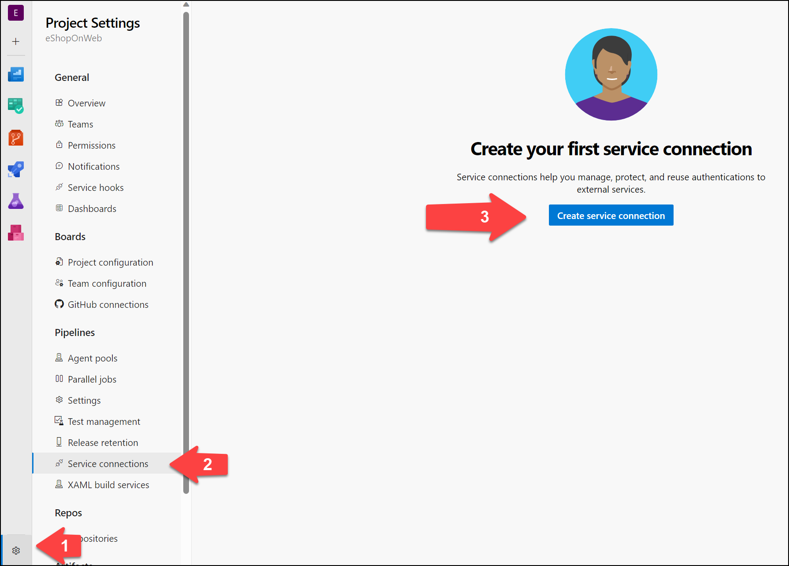

---
lab:
  title: Configuración de una estructura de proyecto y repositorio para admitir canalizaciones seguras
  module: 'Module 1: Configure a project and repository structure to support secure pipelines'
---

# Configuración de una estructura de proyecto y repositorio para admitir canalizaciones seguras

En este laboratorio, aprenderá a configurar una estructura de proyecto y repositorio en Azure DevOps para admitir canalizaciones seguras. En este laboratorio se tratan los procedimientos recomendados para organizar proyectos y repositorios, asignar permisos y administrar archivos seguros.

Estos ejercicios duran aproximadamente **30** minutos.

## Antes de comenzar

Necesitará una suscripción de Azure, una organización de Azure DevOps y la aplicación eShopOnWeb para seguir los laboratorios.

- Siga los pasos para [validar el entorno de laboratorio](APL2001_M00_Validate_Lab_Environment.md).

## Instrucciones

### Ejercicio 1: Configuración de una estructura de proyecto segura

En este ejercicio, configurará una estructura de proyecto segura mediante la creación de un nuevo proyecto y la asignación de permisos de proyecto. La separación de responsabilidades y recursos en diferentes proyectos o repositorios con permisos específicos complementa la seguridad.

#### Tarea 1: Crear un nuevo proyecto de equipo

1. Vaya al portal de Azure DevOps en `https://dev.azure.com` y abra su organización.

1. Abra la **configuración de la organización** en la esquina inferior izquierda del portal y, después, abra **Proyectos** en la sección General.

1. Seleccione la opción **Nuevo proyecto** y use la siguiente configuración:
   - Nombre: **eShopSecurity**
   - Visibilidad: **Privado**
   - Avanzado: Control de versiones: **Git**
   - Avanzado: Proceso de elemento de trabajo: **Scrum**

    

1. Haga clic en **Crear** para crear el proyecto.

1. Ahora puede cambiar entre los diferentes proyectos haciendo clic en el icono de Azure DevOps de la esquina superior izquierda del portal de Azure DevOps.

    

Puede administrar los permisos y la configuración de cada proyecto de equipo por separado. Para ello, vaya al menú Configuración del proyecto y seleccione el proyecto de equipo adecuado. Si tiene varios usuarios o equipos que trabajan en proyectos diferentes, también puede asignar permisos a cada proyecto por separado.

#### Tarea 2: Crear un nuevo repositorio y asignar permisos de proyecto

1. Seleccione el nombre de la organización en la esquina superior izquierda del portal de Azure DevOps y seleccione el nuevo proyecto **eShopSecurity**.

1. Seleccione el menú **Repositorios**.

1. Seleccione el botón **Inicializar** para inicializar el nuevo repositorio agregando el archivo README.md.

1. Abra el menú **Configuración del proyecto** en la esquina inferior izquierda del portal y seleccione **Repositorios** en la sección Repositorios.

1. Seleccione el nuevo repositorio de **eShopSecurity** y seleccione la pestaña **Seguridad**.

1. Quite los permisos Heredar del elemento primario desactivando el botón de alternancia **Herencia**.

1. Seleccione el grupo **Colaboradores** y seleccione la lista desplegable **Denegar** para todos los permisos excepto **Leer**. Esto impedirá que todos los usuarios del grupo Colaboradores accedan al repositorio.

1. Seleccione el usuario en Usuarios y seleccione el botón **Permitir** para permitir todos los permisos.

    

1. (Opcional) Agregue un grupo específico de usuarios o usuario que quiera conceder acceso al repositorio y ejecute canalizaciones desde el proyecto eShopOnWeb. Haga clic en el cuadro de búsqueda, escriba el nombre del grupo, selecciónelo y, a después, establezca los permisos que desea permitir o denegar para el grupo o usuario.

    > [!NOTE]
    > Asegúrese de que tiene el mismo grupo en el proyecto eShopOnWeb. Esto le permitirá ejecutar canalizaciones desde el proyecto eShopOnWeb y acceder al repositorio en el proyecto eShopSecurity.

1. Los cambios se guardarán automáticamente.

Ahora solo el usuario al que asignó permisos y los administradores pueden acceder al repositorio. Esto resulta útil cuando desea permitir que usuarios específicos accedan al repositorio y ejecuten canalizaciones desde el proyecto eShopOnWeb.

### Ejercicio 2: Configuración de una canalización y una estructura de plantilla para admitir canalizaciones seguras

#### Tarea 1: (Si ya la ha completado, omita esta tarea) Importar y ejecutar la canalización de CI

1. Vaya al portal de Azure DevOps en `https://dev.azure.com` y abra su organización.

1. Abra el proyecto **eShopOnWeb** en Azure DevOps.

1. Vaya a **Pipelines (Canalizaciones) > Pipelines (Canalizaciones)**.

1. Seleccione el botón **Crear canalización**.

1. Seleccione **Git de Azure Repos (YAML)**.

1. Seleccione el repositorio **eShopOnWeb**.

1. Seleccione **Archivo YAML de Azure Pipelines existente**.

1. Seleccione el archivo **/.ado/eshoponweb-ci.yml** y seleccione **Continue (Continuar)**.

1. Haga clic en el botón **Run (Ejecutar)** para ejecutar la canalización.

1. La canalización tomará un nombre basado en el nombre del proyecto. Cámbielo para identificar mejor la canalización.

1. Vaya a **Pipelines (Canalizaciones) > Pipelines (Canalizaciones)** y seleccione la canalización creada recientemente. Seleccione los puntos suspensivos (...) y, a continuación, seleccione **Cambiar nombre/mover**.

1. Asígnele el nombre **eshoponweb-ci** y seleccione **Guardar**.

#### Tarea 2: Crear una entidad de servicio y una conexión de servicio para acceder a los recursos de Azure

En esta tarea, creará una entidad de servicio mediante la CLI de Azure y una conexión de servicio en Azure DevOps, lo que le permitirá implementar recursos en la suscripción de Azure.

1. Inicie un explorador web, vaya a Azure Portal en `https://portal.azure.com` e inicie sesión con la cuenta de usuario con el rol Propietario en la suscripción de Azure que va a usar en este laboratorio y que tenga el rol Administrador global en el inquilino de Azure AD asociado con esta suscripción.

1. En Azure Portal, seleccione el botón **Cloud Shell** situado en la parte a la derecha del cuadro de búsqueda de la parte superior de la página.

1. Si se le pide que seleccione **Bash** o **PowerShell**, seleccione **Bash**.

   > [!NOTE]
   > Si es la primera vez que inicia **Cloud Shell** y aparece el mensaje **No tiene ningún almacenamiento montado**, seleccione la suscripción que utiliza en este laboratorio y seleccione **Crear almacenamiento**.

1. En la solicitud de **Bash**, en el panel de **Cloud Shell**, ejecute los siguientes comandos para recuperar los valores del identificador de suscripción de Azure y los atributos de nombre de suscripción:

    ```bash
    az account show --query id --output tsv
    az account show --query name --output tsv
    ```

    > [!NOTE]
    > Copie ambos valores en un archivo de texto. Los necesitará más adelante en este laboratorio.

1. En la solicitud de **Bash**, en el panel de **Cloud Shell**, ejecute el siguiente comando para crear una entidad de servicio:

    ```bash
    az ad sp create-for-rbac --name myServicePrincipalName \
                         --role contributor \
                         --scopes /subscriptions/mySubscriptionID
    ```

    > [!NOTE]
    > Reemplace **myServicePrincipalName** por cualquier cadena única de caracteres que conste de letras y dígitos, por ejemplo **AzureDevOpsSP** y **mySubscriptionID** por su subscriptionId de Azure.

    > [!NOTE]
    > El comando generará una salida JSON. Copie los resultados en un archivo de texto. Lo necesitará más adelante en este laboratorio.

1. Después, vaya al portal de Azure DevOps en `https://dev.azure.com` y abra su organización.

1. Abra el proyecto **eShopOnWeb** y seleccione **Configuración del proyecto** en la esquina inferior izquierda del portal.

1. En Canalizaciones, seleccione **Conexiones de servicio** y, después, seleccione **Crear conexión de servicio**.

    

1. En la hoja **New service connection (Nueva conexión de servicio)**, seleccione **Azure Resource Manager** y, después, seleccione **Next (Siguiente)** (es posible que deba desplazarse hacia abajo).

1. Seleccione **Service Principal (Entidad de servicio) (manual)** y, después, seleccione **Next (Siguiente)**.

1. Rellene los campos vacíos con la información recopilada durante los pasos anteriores:
    - Identificador y nombre de la suscripción.
    - Id. de entidad de servicio (o clientId/AppId), clave de entidad de servicio (o contraseña) y TenantId.
    - En **Nombre de conexión de servicio**, escriba **azure subs**. Se hará referencia a este nombre en canalizaciones de YAML cuando necesite una conexión de servicio de Azure DevOps para comunicarse con la suscripción de Azure.

        

1. No marque **Conceder permiso de acceso a todas las canalizaciones**. Seleccione **Verificar y guardar**.

    > [!NOTE]
    > No se recomienda la opción **Conceder permiso de acceso a todas las canalizaciones** para entornos de producción. Solo se usa en este laboratorio para simplificar la configuración de la canalización.

#### Tarea 3: (Si ya la ha completado, omita esta tarea) Importar y ejecutar la canalización de CD

1. Vaya a **Pipelines (Canalizaciones) > Pipelines (Canalizaciones)**.

1. Seleccione el botón **New Pipeline (Nueva canalización)**.

1. Seleccione **Git de Azure Repos (YAML)**.

1. Seleccione el repositorio **eShopOnWeb**.

1. Seleccione **Archivo YAML de Azure Pipelines existente**.

1. Seleccione el archivo **/.ado/eshoponweb-cd-webapp-code.yml** y, después, seleccione **Continuar**.

1. En la definición de canalización de YAML en la sección variables, personalice lo siguiente:
   - **AZ400-EWebShop-NAME** con el nombre que prefiera, por ejemplo, **rg-eshoponweb-secure**.
   - **Location** con el nombre de la región de Azure en la que desea implementar los recursos, por ejemplo, **southcentralus**.
   - **YOUR-SUBSCRIPTION-ID** por el id. de la suscripción a Azure.
   - **az400eshop-NAME**, con un nombre de aplicación web que se va a implementar con un nombre único global, por ejemplo, **eshoponweb-lab-secure**.

1. Seleccione **Save and Run (Guardar y ejecutar)**, y elija confirmar directamente en la rama principal o crear una nueva rama.

1. Seleccione **Save and Run (Guardar y ejecutar)** de nuevo.

    > [!NOTE]
    > Si decide crear una rama, deberá crear una solicitud de incorporación de cambios para combinar los cambios en la rama principal.

1. Abra la canalización. Si ve el mensaje “This pipeline needs permission to access a resource before this run can continue to Deploy to WebApp (Esta canalización necesita permiso para acceder a un recurso antes de que esta ejecución pueda continuar con Implementar en WebApp)”, seleccione **View (Ver)**, **Permit (Permitir)** y **Permit (Permitir)** de nuevo. Esto es necesario para permitir que la canalización cree el recurso de Azure App Service.

    

1. La implementación puede tardar unos minutos en completarse y esperar a que se ejecute la canalización. La definición de CD consta de las siguientes tareas:
      - **Recursos**: está preparado para desencadenarse automáticamente en función de la finalización de la canalización de CI. También descarga el repositorio para el archivo bicep.
      - **AzureResourceManagerTemplateDeployment**: implementa la aplicación web de Azure mediante la plantilla de bicep.
1. La canalización tomará un nombre basado en el nombre del proyecto. Vamos a cambiarle el nombre para identificar mejor la canalización.

1. Vaya a **Pipelines (Canalizaciones) > Pipelines (Canalizaciones)** y seleccione la canalización creada recientemente. Seleccione los puntos suspensivos (...) y, a continuación, seleccione **Cambiar nombre/mover**.

1. Asígnele el nombre **eshoponweb-cd-webapp-code** y seleccione **Guardar**.

Ahora debería tener dos canalizaciones que se ejecutan en el proyecto eShopOnWeb.


#### Tarea 4: Mover las variables de canalización de CD a una plantilla de YAML

En esta tarea, creará una plantilla de YAML para almacenar las variables usadas en la canalización de CD. Esto le permitirá reutilizar la plantilla en otras canalizaciones.

1. Vaya a **Repositorios** y, después, a **Archivos**.

1. Expanda la carpeta **.ado** y seleccione **Nuevo archivo**.

1. Asigne al archivo el nombre **eshoponweb-secure-variables.yml** y seleccione **Crear**.

1. Agregue la sección variables que se usa en la canalización de CD al nuevo archivo. El archivo debería tener este aspecto:

    ```YAML
    variables:
      resource-group: 'rg-eshoponweb-secure'
      location: 'southcentralus' #name of the Azure region you want to deploy your resources
      templateFile: '.azure/bicep/webapp.bicep'
      subscriptionid: 'YOUR-SUBSCRIPTION-ID'
      azureserviceconnection: 'YOUR-AZURE-SERVICE-CONNECTION-NAME'
      webappname: 'eshoponweb-lab-secure'

    ```

    > [!IMPORTANT]
    > Reemplace los valores de las variables por los valores del entorno (grupo de recursos, ubicación, identificador de suscripción, conexión de servicio de Azure y nombre de la aplicación web).

1. Seleccione **Confirmar**, agregue un comentario y, después, seleccione el botón **Confirmar**.

1. Abra la definición de canalización **eshoponweb-cd-webapp-code.yml** y reemplace la sección variables por lo siguiente:

    ```YAML
    variables:
      - template: eshoponweb-secure-variables.yml
    ```

    > [!NOTE]
    > Si usa una ruta de acceso diferente para el archivo de plantilla, deberá actualizar la ruta de acceso en la definición de canalización.

1. Seleccione **Guardar** y **ejecute** la canalización de nuevo.

Ahora tiene una plantilla de YAML con las variables usadas en la canalización de CD. Puede reutilizar esta plantilla en otras canalizaciones en escenarios en los que necesite implementar los mismos recursos. Además, el equipo de operaciones puede controlar el grupo de recursos y la ubicación donde se implementan los recursos y otra información de los valores de la plantilla y no es necesario realizar ningún cambio en la definición de la canalización.

#### Tarea 5: Mover las plantillas de YAML a un repositorio y proyecto independientes

En esta tarea, moverá las plantillas de YAML a un repositorio y proyecto independientes.

1. En el proyecto eShopSecurity, vaya a **Repositorio > Archivos**.

1. Cree un nuevo archivo denominado **eshoponweb-secure-variables.yml**.

1. Copie el contenido del archivo **.ado/eshoponweb-secure-variables.yml** del repositorio eShopOnWeb al nuevo archivo.

1. Confirme los cambios.

1. Abra la definición de la canalización **eshoponweb-cd-webapp-code.yml** desde el proyecto eShopOnWeb.

1. Agregue lo siguiente a la sección de recursos:

    ```YAML
    resources:
      repositories:
        - repository: eShopSecurity
          type: git
          name: eShopSecurity/eShopSecurity #name of the project and repository

    ```

1. Reemplace la sección variables por el contenido siguiente:

    ```YAML
    variables:
      - template: eshoponweb-secure-variables.yml@eShopSecurity #name of the template and repository
    ```

    

1. Seleccione **Guardar** y **ejecute** la canalización de nuevo. Verá que la canalización usa la plantilla de YAML del repositorio eShopSecurity.

    

Ahora tiene las plantillas de YAML en un repositorio y un proyecto independientes. Puede reutilizar estas plantillas en otras canalizaciones en escenarios en los que necesite implementar los mismos recursos. Además, el equipo de operaciones puede controlar el grupo de recursos, la ubicación, la seguridad y dónde se implementan los recursos y otra información en los valores de plantilla y no es necesario realizar ningún cambio en la definición de la canalización.

### Ejercicio 2: Limpieza de recursos de Azure y Azure DevOps

En este ejercicio, quitará los recursos de Azure y Azure DevOps creados en este laboratorio.

#### Tarea 1: Eliminación de recursos de Azure

1. En Azure Portal, abra el grupo de recursos creado y seleccione **Eliminar grupo de recursos** para todos los recursos creados de este laboratorio.

    

    > [!WARNING]
    > No olvide quitar los recursos de Azure recién creados que ya no use. La eliminación de los recursos sin usar garantiza que no verá cargos inesperados.

#### Tarea 2: Eliminación de canalizaciones de Azure DevOps

1. Vaya al portal de Azure DevOps en `https://dev.azure.com` y abra su organización.

1. Abra el proyecto **eShopOnWeb** .

1. Vaya a **Pipelines (Canalizaciones) > Pipelines (Canalizaciones)**.

1. Vaya a **Canalizaciones > Canalizaciones** y quite las canalizaciones existentes.

## Revisar

En este laboratorio, aprendió a configurar una estructura de proyecto y repositorio en Azure DevOps para admitir canalizaciones seguras. Al administrar los permisos de forma eficaz, puede asegurarse de que los usuarios adecuados tengan acceso a los recursos que necesitan al tiempo que mantienen la seguridad e integridad de las canalizaciones y procesos de DevOps.
