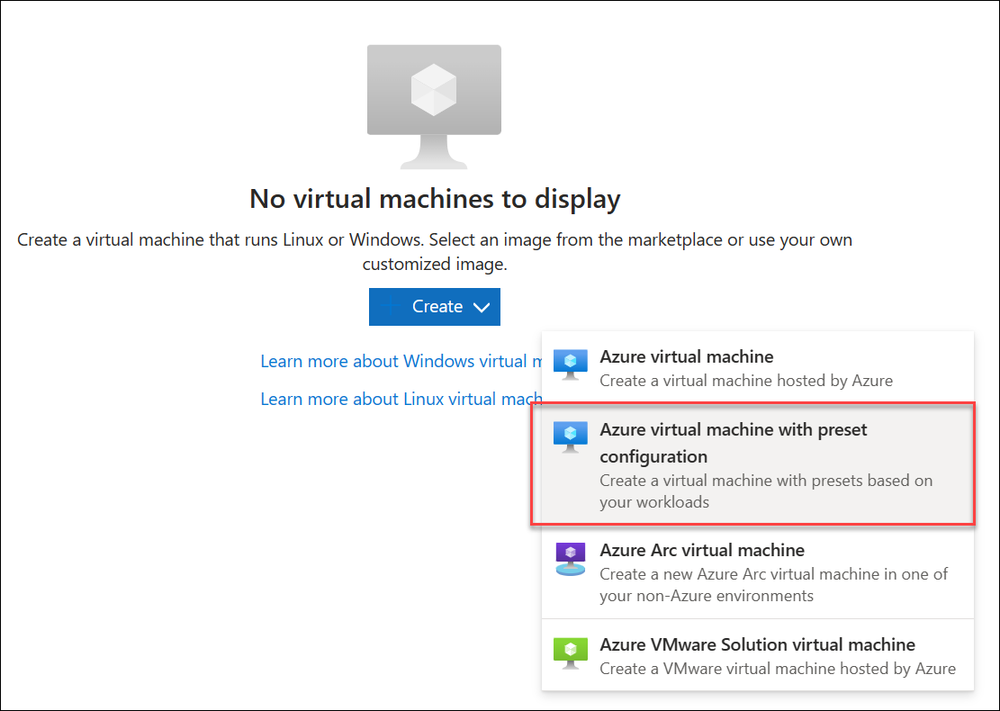

---
lab:
  title: 'Laboratorio: Configurar agentes y grupos de agentes para canalizaciones seguras'
  module: 'Module 2: Configure secure access to pipeline resources'
---

# Laboratorio: Configurar agentes y grupos de agentes para canalizaciones seguras

En este laboratorio, aprenderá a configurar agentes y grupos de agentes de Azure DevOps y a administrar permisos para esos grupos. Los grupos de agentes de Azure DevOps proporcionan los recursos para ejecutar las canalizaciones de compilación y versión.

Estos ejercicios duran aproximadamente **25** minutos.

## Antes de comenzar

Necesitará una suscripción de Azure, una organización de Azure DevOps y la aplicación eShopOnWeb para seguir los laboratorios.

- Siga los pasos para [validar el entorno de laboratorio](APL2001_M00_Validate_Lab_Environment.md).

## Instrucciones

Creará agentes y configurará agentes autohospedados mediante Windows. Si desea configurar agentes en Linux o MacOS, siga las instrucciones de la [documentación de Azure DevOps](https://docs.microsoft.com/azure/devops/pipelines/agents/v2-linux).

Durante la configuración, tenga en cuenta lo siguiente:

- **Mantener agentes independientes por proyecto**: cada agente solo se puede asociar a un grupo. Aunque el uso compartido de grupos de agentes entre proyectos puede ahorrar en costes de infraestructura, también crea el riesgo de movimiento lateral. Por lo tanto, es mejor tener grupos de agentes independientes con agentes dedicados para cada proyecto para evitar la contaminación cruzada.
- **Uso de cuentas con pocos privilegios para los agentes en ejecución**: la ejecución de un agente bajo una identidad con acceso directo a los recursos de Azure DevOps puede suponer amenazas de seguridad. El funcionamiento del agente bajo una cuenta local sin privilegios, como el servicio de red, es aconsejable, lo que minimiza el riesgo.
- **Tenga cuidado con los nombres de grupo engañosos**: el grupo “Cuentas de servicio de recopilación de proyectos” en Azure DevOps conlleva un riesgo de seguridad potencial. La ejecución de agentes mediante una identidad que forma parte de este grupo y respaldada por Azure AD puede poner en peligro la seguridad de toda la organización de Azure DevOps.
- **Evite cuentas con privilegios elevados para agentes autohospedados**: el uso de cuentas con privilegios elevados para ejecutar agentes autohospedados, especialmente para acceder a secretos o entornos de producción, puede exponer el sistema a amenazas graves si una canalización está en peligro.
- **Priorice la seguridad**: para proteger los sistemas, use la cuenta con privilegios mínimos para ejecutar agentes autohospedados. Por ejemplo, use la cuenta de la máquina o una identidad de servicio administrada. También es aconsejable permitir que Azure Pipelines controle el acceso a secretos y entornos.

### Ejercicio 1: Creación de agentes y configuración de grupos de agentes

En este ejercicio, creará una máquina virtual (VM) de Azure y la usará para crear un agente y configurar grupos de agentes.

#### Tarea 1: Creación de una VM de Azure y conexión a ella

1. En el explorador, abra Azure Portal desde `https://portal.azure.com`. Si se le solicita, inicie sesión con una cuenta con el rol Propietario en su suscripción de Azure.

1. En el cuadro **Buscar recursos, servicios y documentos (G+/)**, escriba **Máquinas virtuales** y selecciónelo en la lista desplegable.

1. Seleccione el botón **Crear**.

1. Seleccione **Máquina virtual de Azure con configuración preestablecida**.

    

1. Seleccione **Dev/Test** como entorno de carga de trabajo y **De uso general** como tipo de carga de trabajo.

1. Seleccione el botón **Seguir creando una VM**; en la pestaña **Aspectos básicos**, realice las siguientes acciones y, luego, seleccione **Administración**:

   | Configuración | Acción |
   | -- | -- |
   | Lista desplegable de **Suscripción** | Seleccione su suscripción a Azure. |
   | Sección **Grupo de recursos** | Cree un grupo de recursos denominado **rg-eshoponweb-agentpool**. |
   | Cuadro de texto **Nombre de máquina virtual**  | Escriba el nombre que prefiera, por ejemplo, **eshoponweb-vm**. |
   | Lista desplegable de **región** | Seleccione la misma región de Azure que eligió anteriormente en este laboratorio. |
   | Lista desplegable **Opciones de disponibilidad** | Seleccione **No se requiere redundancia de la infraestructura**. |
   | Lista desplegable **Tipo de seguridad** | Seleccione la opción **Máquinas virtuales de inicio seguro**. |
   | Lista desplegable de **imágenes** | Seleccione la imagen **Windows Server 2022 Datacenter: Azure Edition - x64 Gen2**. |
   | Lista desplegable de **Tamaño** | Seleccione el tamaño **estándar** más barato para realizar pruebas. |
   | Cuadro de texto **Nombre de usuario** | Escriba el nombre de usuario que prefiera. |
   | Cuadro de texto **Contraseña** | Escriba la contraseña que prefiera. |
   | Sección **Puertos de entrada públicos** | Seleccione **Permitir los puertos seleccionados**. |
   | Lista desplegable **Seleccionar puertos de entrada** | Seleccione **RDP (3389)**. |

1. En la pestaña **Administración**, en la sección **Identidad**, seleccione la casilla de verificación **Habilitar identidad administrada asignada por el sistema** y, luego, seleccione **Revisar y crear**:

1. En la pestaña **Revisar y crear**, seleccione **Crear**.

   > [!NOTE]
   > Espere a que se complete el proceso de aprovisionamiento. Este proceso tardará alrededor de 2 minutos.

1. En Azure Portal, vaya a la página que muestra la configuración de la VM de Azure recién creada. 

1. En la página de la VM de Azure, seleccione **Conectar**, en el menú desplegable, seleccione **Conectar**y, luego, seleccione **Descargar archivo RDP**y use el archivo RDP descargado para establecer una sesión de Escritorio remoto en el sistema operativo que se ejecuta en la VM de Azure.

#### Tarea 2: Creación de un grupo de agentes

1. En la sesión de Escritorio remoto a la VM de Azure, inicie el explorador web de Microsoft Edge.

1. En el explorador web, vaya al portal de Azure DevOps en `https://dev.azure.com` e inicie sesión para acceder a la organización.

1. Abra el proyecto **eShopOnWeb** y seleccione **Configuración del proyecto** en el menú inferior izquierdo.

1. En **Canalizaciones > Grupos de agentes**, seleccione el botón **Agregar grupo**.

1. Elija el tipo de grupo **autohospedado**.

1. Proporcione un nombre para el grupo de agentes, como **eShopOnWebSelfPool** y agregue una descripción opcional.

1. Seleccione **Conceder permiso de acceso a todas las canalizaciones**.

   

1. Seleccione el botón **Crear** para crear el grupo de agentes.

#### Tarea 3: Descarga y extracción de los archivos de instalación del agente

1. En el portal de Azure DevOps, seleccione el grupo de agentes recién creado y, luego, seleccione la pestaña **Agentes**.

1. Seleccione el botón **Nuevo agente** y, a continuación, el botón **Descargar** de la nueva ventana emergente **Descargar agente**.

   > [!NOTE]
   > Siga las instrucciones para instalar el agente.

1. Inicie una sesión de PowerShell y ejecute los siguientes comandos para crear una carpeta denominada **agente**.

   ```powershell
   mkdir agent ; cd agent        
   ```

   > [!NOTE]
   > Asegúrese de que se encuentra en la carpeta raíz del perfil de usuario o en la carpeta donde desea instalar el agente.

1. Ejecute el siguiente comando para extraer el contenido de los archivos del instalador del agente descargados:

   ```powershell
   Add-Type -AssemblyName System.IO.Compression.FileSystem ; [System.IO.Compression.ZipFile]::ExtractToDirectory("$HOME\Downloads\vsts-agent-win-x64-3.232.0.zip", "$PWD")
   ```

   > [!NOTE]
   > Si descargó el agente en otra ubicación (o la versión descargada difiere), ajuste el comando anterior en consecuencia.

#### Tarea 4: Creación de un token PAT

> [!NOTE]
> Antes de configurar el agente, debe crear un token PAT (a menos que tenga uno existente). Para crear un token PAT, siga estos pasos:

1. En la sesión de Escritorio remoto a la VM de Azure, abra otra ventana del explorador, vaya al portal de Azure DevOps en `https://dev.azure.com`y acceda a la organización.

1. Seleccione **Configuración de usuario** en el menú superior derecho (directamente a la izquierda del icono de avatar del usuario).

1. Seleccione el elemento de menú **Token de acceso personal**.

   

1. Seleccione el botón **Nuevo token**.

1. Proporcione un nombre para el token, como **eShopOnWebToken**.

1. Seleccione la organización de Azure DevOps para la que quiere usar el token.

1. Establezca la fecha de expiración del token (solo se usa para configurar el agente).

1. Seleccione el ámbito definido personalizado.

1. Seleccione mostrar todos los ámbitos.

1. Seleccione el ámbito **Grupos de agentes (Leer y administrar).**

1. Seleccione el botón **Crear** para crear el token.

1. Copie el valor del token y guárdelo en un lugar seguro (no podrá volver a verlo. Solo puede regenerar el token).

   

   > [!IMPORTANT]
   > Use la opción de privilegios mínimos, **Grupos de agentes (leer y administrar)**, solo para la configuración del agente. Además, asegúrese de establecer la fecha de expiración mínima para el token si ese es el único propósito del token. Puede crear otro token con los mismos privilegios si necesita volver a configurar el agente.

#### Tarea 5: Configuración del agente

1. En la sesión de Escritorio remoto a la VM de Azure, vuelva a la ventana de PowerShell. Si es necesario, cambie del directorio actual a aquél en el que extrajo los archivos de instalación del agente anteriormente en este ejercicio. 

1. Para configurar el agente a fin de que se ejecute desatendido, invoque el siguiente comando:

   ```powershell
   .\config.cmd
   ```

   > [!NOTE]
   > Si desea ejecutar el agente de forma interactiva, use `.\run.cmd` en su lugar. 

1. Para configurar el agente, realice las siguientes acciones cuando se le solicite:

   - Escriba la dirección URL de la organización de Azure DevOps (**dirección URL del servidor**) en el formato `https://dev.azure.com/`{nombre de la organización}.
   - Acepte el tipo de autenticación predeterminado (**PAT**).
   - Escriba el valor del token PAT que creó en el paso anterior.
   - Escriba el nombre del grupo de agentes **eShopOnWebSelfPool** que creó anteriormente en este ejercicio.
   - Escriba el nombre del agente **eShopOnWebSelfAgent**.
   - Acepte la carpeta de trabajo del agente predeterminada (_work).
   - Escriba **Y** para configurar el agente a fin de que se ejecute como servicio.
   - Escriba **Y** para habilitar SERVICE_SID_TYPE_UNRESTRICTED para el servicio del agente.
   - Escriba **NT AUTHORITY\SYSTEM** para establecer el contexto de seguridad para el servicio.

   > [!IMPORTANT]
   > En general, debe seguir el principio de privilegios mínimos al configurar el contexto de seguridad del servicio.

   - Acepte la opción predeterminada (**N**) para permitir que el servicio se inicie inmediatamente después de finalizar la configuración.

   

1. Para comprobar el estado del agente, cambie al explorador web que muestra el portal de Azure DevOps, vaya al grupo de agentes y haga clic en la pestaña **Agentes**. Debería ver el nuevo agente en la lista.

   

   > [!NOTE]
   > Para obtener más información sobre los agentes de Windows, consulte: [Agentes de Windows autohospedados](https://learn.microsoft.com/azure/devops/pipelines/agents/windows-agent).

   > [!IMPORTANT]
   > Para que el agente pueda compilar e implementar recursos de Azure desde las canalizaciones de Azure DevOps (que configurará en los próximos laboratorios), debe instalar la CLI de Azure en el sistema operativo de la máquina virtual de Azure que hospeda el agente.

1. Inicie un explorador web y vaya a la página [Instalación de la CLI de Azure en Windows](https://learn.microsoft.com/en-us/cli/azure/install-azure-cli-windows?tabs=azure-cli#install-or-update).

1. Descargue e instale la CLI de Azure. 

1. En el explorador web, vaya a la página del instalador del SDK de Microsoft .NET 7.0 en `https://dotnet.microsoft.com/en-us/download/dotnet/thank-you/sdk-7.0.404-windows-x64-installer`.

1. Descargue e instale el SDK de Microsoft .NET 7.0.

### Ejercicio 2: Creación y configuración de roles de seguridad

En este ejercicio, configurará la seguridad para el grupo de agentes.

#### Tarea 3: Creación de un grupo de seguridad de red

1. En la sesión de Escritorio remoto a la VM de Azure, en el explorador web que muestra el portal de Azure DevOps, en el panel **Configuración del proyecto**, en la sección **General**, seleccione **Permisos **.

1. Seleccione el botón **Nuevo grupo**.

1. Proporcione un nombre para el grupo, como **eShopOnWeb Security Group**.

1. Seleccione el botón **Crear** para crear el grupo.

   

#### Tarea 4: Configuración del grupo de seguridad

1. En la ventana del explorador web que muestra el portal de Azure Devops, seleccione el nuevo grupo para mostrar la pestaña **Permisos**.

1. Deniegue los permisos innecesarios para el grupo, como **Cambiar nombre de proyecto de equipo**, **Eliminar definitivamente elementos de trabajo**o cualquier otro permiso que no quiera que tenga el grupo, ya que se supone que solo se usará para el grupo de agentes.

   

   > [!IMPORTANT]
   > Si deja permisos que no desea que el grupo tenga, los scripts o las tareas que se ejecutan en el agente pueden usar los permisos de grupo para realizar acciones que no desea que realicen.

#### Tarea 3: Administración de permisos del grupo de agentes

En esta tarea, administrará los permisos del grupo de agentes.

1. En la ventana del explorador web que muestra el portal de Azure Devops, en la **Configuración del proyecto** del proyecto **eShopOnWeb**, en la sección **Canalizaciones**, seleccione **Grupos de agentes**.

1. Seleccione el grupo de agentes **eShopOnWebSelfPool**.

1. En la vista de detalles del grupo de agentes, seleccione la pestaña **Seguridad**.

1. Seleccione el botón **Agregar** y agregue el nuevo grupo **eShopOnWeb Security Group** a los permisos de usuario del grupo de agentes.

1. Elija el rol adecuado para el usuario o grupo, como lector, usuario o administrador del grupo de agentes. En este caso, seleccione **Usuario**.

1. Seleccione **Agregar** para aplicar los permisos.

   

Ya tiene todo listo para usar de forma segura el grupo de agentes en las canalizaciones. Para obtener más información sobre los grupos de agentes, consulte [Grupos de agentes](https://learn.microsoft.com/azure/devops/pipelines/agents/pools-queues).

### Ejercicio 4: Limpiar recursos de Azure y Azure DevOps

En este ejercicio, realizará la limpieza posterior al laboratorio de los recursos de Azure DevOps creados en este laboratorio.

#### Tarea 1: Detener y desasignar la máquina virtual de Azure

> [!NOTE]
> Usará la máquina virtual de Azure que creó en este laboratorio en el siguiente laboratorio, por lo que, en lugar de eliminarla, la detendrá y desasignará para eliminar los cargos de proceso.

1. En Azure Portal, vaya a la página que muestra la máquina virtual de Azure **eshoponweb-vm** que ha implementado en este laboratorio

1. En la página de la máquina virtual de Azure **eshoponweb-vm**, en la barra de herramientas, seleccione **Detener** para desasignarla.

#### Tarea 2: Eliminación de recursos de Azure DevOps

> [!NOTE]
> Usará el agente autohospedado que creó en este laboratorio en el siguiente laboratorio, por lo que, en lugar de eliminarlo, solo revocará el token de acceso personal usado para configurarlo. Esto no impedirá que se ejecute más adelante.

1. En el portal de Azure DevOps, seleccione **Configuración de usuario** en el menú superior derecho (directamente a la izquierda del icono de avatar del usuario).

1. Seleccione el elemento de menú **Token de acceso personal**.

   

1. Seleccione la entrada **eShopOnWebToken**. 

1. Seleccione **Revocar** y, cuando se le pida que confirme, seleccione **Revocar** de nuevo.

## Revisar

En este laboratorio, aprenderá a configurar agentes autohospedados y grupos de agentes de Azure DevOps y a administrar permisos para esos grupos. Al administrar los permisos de forma eficaz, puede asegurarse de que los usuarios adecuados tengan acceso a los recursos que necesitan al tiempo que mantienen la seguridad e integridad de los procesos de DevOps.
