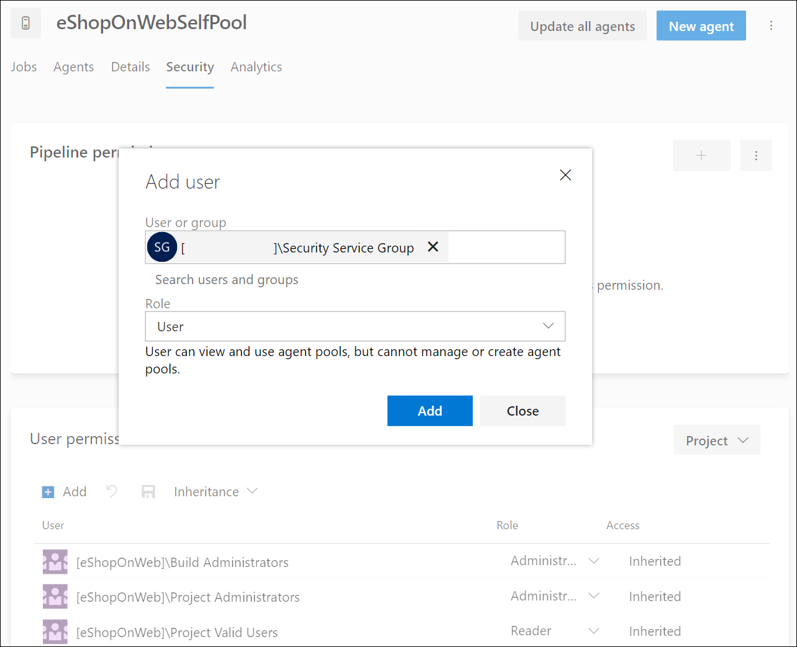

---
lab:
  title: 'Laboratorio: Configurar agentes y grupos de agentes para canalizaciones seguras'
  module: 'Module 3: Configure secure access to pipeline resources'
---

# Laboratorio: Configurar agentes y grupos de agentes para canalizaciones seguras

En este laboratorio, aprenderá a configurar agentes y grupos de agentes de Azure DevOps y a administrar permisos para esos grupos. Los grupos de agentes de Azure DevOps proporcionan los recursos para ejecutar las canalizaciones de compilación y versión.

Estos ejercicios duran aproximadamente **25** minutos.

## Antes de comenzar

Necesitará una suscripción de Azure, una organización de Azure DevOps y la aplicación eShopOnWeb para seguir los laboratorios.

- Siga los pasos para [validar el entorno de laboratorio](APL2001_M00_Validate_Lab_Environment.md).
- Token PAT para la configuración del agente.

## Instrucciones

Creará agentes y configurará agentes autohospedados mediante Windows. Si desea configurar agentes en Linux o MacOS, siga las instrucciones de la [documentación de Azure DevOps](https://docs.microsoft.com/azure/devops/pipelines/agents/v2-linux).

Durante la configuración, tenga en cuenta lo siguiente:

- **Mantener agentes independientes por proyecto**: cada agente solo se puede asociar a un grupo. Aunque el uso compartido de grupos de agentes entre proyectos puede ahorrar en costes de infraestructura, también crea el riesgo de movimiento lateral. Por lo tanto, es mejor tener grupos de agentes independientes con agentes dedicados para cada proyecto para evitar la contaminación cruzada.
- **Uso de cuentas con pocos privilegios para los agentes en ejecución**: la ejecución de un agente bajo una identidad con acceso directo a los recursos de Azure DevOps puede suponer amenazas de seguridad. El funcionamiento del agente bajo una cuenta local sin privilegios, como el servicio de red, es aconsejable, lo que minimiza el riesgo.
- **Tenga cuidado con los nombres de grupo engañosos**: el grupo “Cuentas de servicio de recopilación de proyectos” en Azure DevOps conlleva un riesgo de seguridad potencial. La ejecución de agentes mediante una identidad que forma parte de este grupo y respaldada por Azure AD puede poner en peligro la seguridad de toda la organización de Azure DevOps.
- **Evite cuentas con privilegios elevados para agentes autohospedados**: el uso de cuentas con privilegios elevados para ejecutar agentes autohospedados, especialmente para acceder a secretos o entornos de producción, puede exponer el sistema a amenazas graves si una canalización está en peligro.
- **Priorice la seguridad**: para proteger los sistemas, use la cuenta con privilegios mínimos para ejecutar agentes autohospedados. Por ejemplo, use la cuenta de la máquina o una identidad de servicio administrada. También es aconsejable permitir que Azure Pipelines controle el acceso a secretos y entornos.

### Ejercicio 1: Creación de agentes y configuración de grupos de agentes

En este ejercicio, creará un agente y configurará grupos de agentes.

#### Tarea 1: Creación de un grupo de agentes

1. Vaya al portal de Azure DevOps en `https://dev.azure.com` y abra su organización.

1. Abra el proyecto **eShopOnWeb** y seleccione **Configuración del proyecto** en el menú inferior izquierdo.

1. En **Canalizaciones > Grupos de agentes**, seleccione el botón **Agregar grupo**.

1. Elija el tipo de grupo **autohospedado**.

1. Proporcione un nombre para el grupo de agentes, como **eShopOnWebSelfPool** y agregue una descripción opcional.

1. Seleccione **Conceder permiso de acceso a todas las canalizaciones**.

    

1. Seleccione el botón **Crear** para crear el grupo de agentes.

#### Tarea 2: Creación de un agente

1. Seleccione el grupo de agentes recién creado y, a continuación, seleccione la pestaña **Agentes**.

1. Seleccione el botón **Nuevo agente** y, a continuación, el botón **Descargar** de la nueva ventana emergente **Descargar agente**.

1. Siga las instrucciones de instalación para instalar el agente en el equipo desde la ventana emergente.
   1. Ejecute los siguientes comandos desde PowerShell para crear una carpeta de agente en la máquina.

        ```powershell
        mkdir agent ; cd agent        
        ```

        > [!NOTE]
        > Asegúrese de que se encuentra en la carpeta raíz del perfil de usuario o en la carpeta donde desea instalar el agente.

   2. Si elige la carpeta **Descargar** en la máquina, en PowerShell, ejecute el comando sugerido:

        ```powershell
        Add-Type -AssemblyName System.IO.Compression.FileSystem ; [SysteIO.Compression.ZipFile]::ExtractToDirecto("$HOME\Downloads\vsts-agent-win-x64-3.220.2.zip", "$PWD")
        
        ```
        > [!NOTE]
        > Si descargó el agente en otra ubicación, vuelva a crear la ruta de acceso en el comando anterior.

#### Tarea 3: Creación de un token PAT

Antes de configurar el agente, cree un nuevo token PAT o elija uno existente. Siga estos pasos para crear un token PAT:

1. Vaya al portal de Azure DevOps en `https://dev.azure.com` y abra su organización.

1. Vaya al proyecto eShopOnWeb y seleccione **Configuración de usuario** en el menú superior derecho (a la izquierda de la imagen del perfil de usuario).

1. Seleccione el menú **Tokens de acceso personal**.

    

1. Seleccione el botón **Nuevo token**.

1. Proporcione un nombre para el token, como **eShopOnWebToken**.

1. Seleccione la organización de Azure DevOps en la que desea usar el token.

1. Establezca la fecha de expiración del token (solo se usa para configurar el agente).

1. Seleccione el ámbito definido personalizado.

1. Seleccione mostrar todos los ámbitos.

1. Seleccione el ámbito **Grupos de agentes (Leer y administrar).**

1. Seleccione el botón **Crear** para crear el token.

1. Copie el valor del token y guárdelo en un lugar seguro (no podrá volver a verlo. Solo puede regenerar el token).

    

    > [!IMPORTANT]
    > Use la última opción de privilegios, **Grupos de agentes (Leer y administrar)** solo para la configuración del agente. Además, asegúrese de establecer la fecha de expiración mínima para el token si es el único propósito del token. Puede crear un nuevo token con los mismos privilegios si necesita volver a configurar el agente.

#### Tarea 4: Configurar el agente

1. Abra una nueva ventana de PowerShell y vaya a la carpeta del agente que creó en el paso anterior.

1. Ejecute el siguiente comando para configurar el agente:

    ```powershell
    .\config.cmd
    ```

    > [!NOTE]
    > Opcionalmente, ejecute el agente de forma interactiva mediante la ejecución de .\run.cmd. No se puede cerrar la ventana del símbolo del sistema mientras se ejecuta de forma interactiva.

1. Cuando se le solicite configurar el agente, escriba la siguiente información:
    - Escriba la dirección URL de la organización de Azure DevOps: `https://dev.azure.com/`{nombre de su organización}.
    - Elija el tipo de autenticación: **PAT**.
    - Escriba el valor del token PAT que creó en el paso anterior.
    - Escriba el nombre del grupo de agentes **eShopOnWebSelfPool** que creó en el paso anterior.
    - Escriba el nombre del agente **eShopOnWebSelfAgent**.
    - Elija la carpeta de trabajo del agente (el valor predeterminado es _work).
    - Elija el modo de ejecución del agente (Y para ejecutar como servicio).
    - Escriba Y para habilitar SERVICE_SID_TYPE_UNRESTRICTED para el servicio del agente (solo Windows).
    - Escriba la cuenta de usuario que se va a usar para el servicio.

        > [!IMPORTANT]
        > Para ejecutar el servicio del agente, no use cuentas con privilegios elevados. En su lugar, emplee una cuenta con pocos privilegios que contenga los permisos mínimos necesarios para el funcionamiento del servicio. Este enfoque ayuda a mantener un entorno seguro y estable.

    - Indique si desea evitar que el servicio se inicie inmediatamente después de finalizar la configuración (N para iniciar el servicio).

        

    - Para comprobar el estado del agente, vaya al grupo de agentes y haga clic en la pestaña **Agentes**. Debería ver el nuevo agente en la lista.

        

Para obtener más información sobre los agentes de Windows, consulte: [Agentes de Windows autohospedados](https://learn.microsoft.com/azure/devops/pipelines/agents/windows-agent).

### Ejercicio 2: Creación y configuración de un nuevo grupo de seguridad para el grupo de agentes

En este ejercicio, creará un nuevo grupo de seguridad para el grupo de agentes.

#### Tarea 3: Creación de un grupo de seguridad de red

1. Vaya al portal de Azure DevOps en `https://dev.azure.com` y abra su organización.

1. Abra el proyecto **eShopOnWeb** y seleccione **Configuración del proyecto** en el menú inferior izquierdo.

1. Abra Permisos en General.

1. Seleccione el botón **Nuevo grupo**.

1. Proporcione un nombre para el grupo, como **eShopOnWeb Security Group**.

1. Agregue los usuarios que desea formar parte del grupo.

1. Seleccione el botón **Crear** para crear el grupo.

    

#### Tarea 4: Configuración del grupo de seguridad

1. Seleccione el nuevo grupo para mostrar su pestaña **Permisos**.

1. Deniegue permisos innecesarios para el grupo, como **Cambiar nombre del proyecto de equipo**, **Eliminar permanentemente elementos de trabajo** o cualquier otro permiso que no quiera que tenga el grupo, ya que solo se usa para el grupo de agentes.

    

    > [!IMPORTANT]
    > Si deja permisos que no desea que el grupo tenga, los scripts o las tareas que se ejecutan en el agente pueden usar los permisos de grupo para realizar acciones que no desea que realicen.

### Ejercicio: Administración de permisos de grupo de agentes

En este ejercicio, administrará los permisos para el grupo de agentes.

1. Vaya al portal de Azure DevOps en `https://dev.azure.com` y abra su organización.

1. Abra el proyecto **eShopOnWeb** y seleccione **Configuración del proyecto** en el menú inferior izquierdo.

1. Seleccione **Canalizaciones** y, luego, elija **Grupos de agentes**.

1. Seleccione el grupo de agentes **eShopOnWebSelfPool**.

1. En la vista de detalles del grupo de agentes, seleccione la pestaña **Seguridad**.

1. Seleccione el botón **Agregar** y agregue el nuevo grupo **eShopOnWeb Security Group** a los permisos de usuario del grupo de agentes.

1. Elija el rol adecuado para el usuario o grupo, como lector, usuario o administrador del grupo de agentes. En este caso, seleccione **Usuario**.

1. Seleccione Agregar para aplicar los permisos.

    

Ya tiene todo listo para usar de forma segura el grupo de agentes en las canalizaciones. Para obtener más información sobre los grupos de agentes, consulte [Grupos de agentes](https://learn.microsoft.com/azure/devops/pipelines/agents/pools-queues).

### Ejercicio 4: Eliminación de los recursos del laboratorio de Azure

1. Detenga y quite el servicio del agente. Para ello, ejecute `.config.cmd remove`.

1. Elimine el grupo de agentes.

1. Elimine el grupo de seguridad.

1. Revoque el token PAT.

## Revisar

En este laboratorio, aprenderá a configurar agentes autohospedados y grupos de agentes de Azure DevOps y a administrar permisos para esos grupos. Al administrar los permisos de forma eficaz, puede asegurarse de que los usuarios adecuados tengan acceso a los recursos que necesitan al tiempo que mantienen la seguridad e integridad de los procesos de DevOps.
