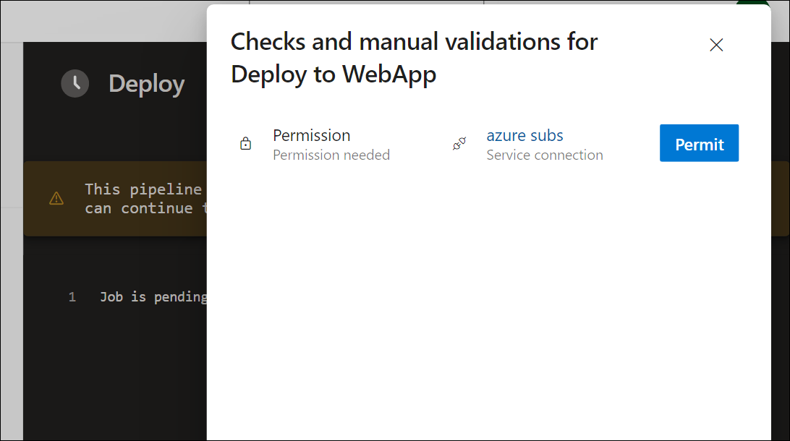

---
lab:
  title: 'Laboratorio: Administración de la identidad para proyectos y canalizaciones'
  module: 'Module 3: Manage identity for projects, pipelines, and agents'
---

# Laboratorio: Administración de la identidad para proyectos y canalizaciones

Las identidades administradas ofrecen un método seguro para controlar el acceso a los recursos de Azure. Azure controla estas identidades automáticamente, lo que te permite comprobar el acceso a los servicios compatibles con la autenticación de Azure AD. Esto significa que no es necesario insertar credenciales en el código, lo que mejora la seguridad. En Azure DevOps, las identidades administradas pueden autenticar los recursos de Azure dentro de los agentes autohospedados, lo que simplifica el control de acceso sin poner en peligro la seguridad.

En este laboratorio, crearás una identidad administrada y la usarás en canalizaciones de YAML de Azure DevOps que se ejecutan en agentes autohospedados para implementar recursos de Azure.

El laboratorio dura aproximadamente **30** minutos.

## Antes de comenzar

Necesitarás una suscripción a Azure, una organización de Azure DevOps y la aplicación eShopOnWeb para seguir los laboratorios.

- Comprueba que tienes una cuenta Microsoft o de Microsoft Entra con el rol Propietario o Colaborador en la suscripción a Azure. Para obtener más información, consulta [Enumeración de asignaciones de roles de Azure mediante Azure Portal](https://learn.microsoft.com/azure/role-based-access-control/role-assignments-list-portal) y [Ver y asignar roles de administrador en Azure Active Directory](https://learn.microsoft.com/azure/active-directory/roles/manage-roles-portal).

## Requisitos previos

Completar los laboratorios:

- Sigue los pasos para [validar el entorno de laboratorio](APL2001_M00_Validate_Lab_Environment.md).
- [Configuración de una estructura de proyecto y repositorio para admitir canalizaciones seguras](APL2001_M01_L01_Configure_a_Project_and_Repository_Structure_to_Support_Secure_Pipelines.md)
- [Configuración de agentes y grupos de agentes para canalizaciones seguras](APL2001_M02_L02_Configure_Agents_And_Agent_Pools_for_Secure_Pipelines.md)

## Instrucciones

### Ejercicio 0: (omitir si ya lo has completado) importación y ejecución de canalizaciones de CI/CD

En este ejercicio, importarás y ejecutarás las canalizaciones de CI/CD en el proyecto de Azure DevOps.

#### Tarea 1: (omitir si ya la has completado) Importación y ejecución de la canalización de CI

Empecemos importando la canalización de CI denominada [eshoponweb-ci.yml](https://github.com/MicrosoftLearning/eShopOnWeb/blob/main/.ado/eshoponweb-ci.yml).

1. Ve al portal de Azure DevOps en `https://aex.dev.azure.com` y abre tu organización.

1. Abre el proyecto **eShopOnWeb** en Azure DevOps.

1. Ve a **Canalizaciones > Canalizaciones**.

1. Selecciona el botón **Crear canalización**.

1. Selecciona **Git de Azure Repos (YAML)**.

1. Selecciona el repositorio **eShopOnWeb**.

1. Selecciona **Archivo YAML de Azure Pipelines existente**.

1. Selecciona el archivo **/.ado/eshoponweb-ci.yml** y haz clic en **Continuar**.

1. Haz clic en el botón **Ejecutar** para ejecutar la canalización.

   > **Nota**: la canalización adoptará un nombre en función del nombre del proyecto. Cambiarás el nombre para identificar la canalización con más facilidad.

1. Ve a **Canalizaciones > Canalizaciones** y selecciona la canalización creada recientemente. Selecciona los puntos suspensivos (...) y, a continuación, selecciona **Cambiar nombre/mover**.

1. Asígnale el nombre **eshoponweb-ci** y selecciona **Guardar**.

#### Tarea 2: (omitir si ya la has completado) Importación y ejecución de la canalización de CD

> **Nota**: en esta tarea, importarás y ejecutarás la canalización de CD denominada [eshoponweb-cd-webapp-code.yml](https://github.com/MicrosoftLearning/eShopOnWeb/blob/main/.ado/eshoponweb-cd-webapp-code.yml).

1. Ve a **Canalizaciones > Canalizaciones**.

1. Selecciona el botón **Nueva canalización**.

1. Selecciona **Git de Azure Repos (YAML)**.

1. Selecciona el repositorio **eShopOnWeb**.

1. Selecciona **Archivo YAML de Azure Pipelines existente**.

1. Selecciona el archivo **/.ado/eshoponweb-cd-webapp-code.yml** y, después, selecciona **Continuar**.

1. En la definición de canalización de YAML, establece la sección variables de la siguiente manera:

   ```yaml
   variables:
     resource-group: 'YOUR-RESOURCE-GROUP-NAME'
     location: 'centralus'
     templateFile: 'infra/webapp.bicep'
     subscriptionid: 'YOUR-SUBSCRIPTION-ID'
     azureserviceconnection: 'YOUR-AZURE-SERVICE-CONNECTION-NAME'
     webappname: 'YOUR-WEB-APP-NAME'
   ```

1. Reemplaza los valores de las variables por los valores correctos de tu entorno:

   - Reemplaza **YOUR-RESOURCE-GROUP-NAME** por el nombre del grupo de recursos que deseas usar en este laboratorio, por ejemplo, **rg-eshoponweb-multi**.
   - Establece el valor de la variable **location** en el nombre de la región de Azure en la que quieres implementar los recursos, por ejemplo, **centralus**.
   - Reemplaza **YOUR-SUBSCRIPTION-ID** por tu identificador de suscripción a Azure.
   - Reemplaza **YOUR-AZURE-SERVICE-CONNECTION-NAME** por **azure subs**
   - Reemplaza **YOUR-WEB-APP-NAME** por un nombre único global de la aplicación web que se va a implementar, por ejemplo, la cadena **eshoponweb-lab-multi-123456** seguida de un número aleatorio de seis dígitos.

1. Selecciona **Guardar y ejecutar** y elige "commit" directamente en la rama principal.

1. Selecciona **Guardar y ejecutar** de nuevo.

1. Abre la ejecución de la canalización. Si ves el mensaje “Esta canalización necesita permiso para acceder a un recurso antes de que esta ejecución pueda continuar con Implementar en WebApp”, selecciona **Ver**, **Permitir** y **Permitir** de nuevo. Esto es necesario para permitir que la canalización cree el recurso de Azure App Service.

   

1. La implementación puede tardar unos minutos en completarse, espera a que se ejecute la canalización. La canalización se desencadena después de la finalización de la canalización de CI e incluye las siguientes tareas:

   - **AzureResourceManagerTemplateDeployment**: Implementa la aplicación web de Azure App Service mediante una plantilla de Bicep.
   - **AzureRmWebAppDeployment**: Publica el sitio web en la aplicación web de Azure App Service.

   > **Nota**: en caso de que se produzca un error en la implementación, ve a la página de ejecución de la canalización y selecciona **Volver a ejecutar trabajos con errores** para invocar otra ejecución de canalización.

   > **Nota**: la canalización adoptará un nombre en función del nombre del proyecto. Vamos a **cambiarle el nombre** para identificar mejor la canalización.

1. Ve a **Canalizaciones > Canalizaciones** y selecciona la canalización creada recientemente. Selecciona los puntos suspensivos (...) y, a continuación, selecciona la opción **Cambiar nombre/mover**.

1. Asígnale el nombre **eshoponweb-cd-webapp-code** y haz clic en **Guardar**.

### Ejercicio 1: Configuración de la identidad administrada en Azure Pipelines

En este ejercicio, usarás una identidad administrada para configurar una nueva conexión de servicio e incorporarla a las canalizaciones de CI/CD.

#### Tarea 1: Establecimiento de la identidad administrada en la suscripción a Azure

1. En el explorador, abre Azure Portal desde `https://portal.azure.com`.

1. En Azure Portal, ve a la página que muestra la VM de Azure **eshoponweb-vm** que implementaste en el [laboratorio anterior](APL2001_M02_L02_Configure_Agents_And_Agent_Pools_for_Secure_Pipelines.md).

1. En la página de VM de Azure **eshoponweb-vm**, en la barra de herramientas, selecciona **Iniciar** para iniciarla, en caso de que esté detenida.

1. En la página de VM de Azure **eshoponweb-vm**, en el lado izquierdo, en la sección **Seguridad**, selecciona **Identidad**.

1. En la página **Identidad**, comprueba que **Estado** está **Activado** y selecciona **Asignaciones de roles de Azure**.

1. Selecciona el botón **Agregar asignación de roles** y realiza las siguientes acciones:

   | Configuración | Acción |
   | -- | -- |
   | Lista desplegable de **Ámbito** | Selecciona **Suscripción**. |
   | Lista desplegable de **Suscripción** | Selecciona tu suscripción a Azure. |
   | Lista desplegable de **Roles** | Selecciona el rol **Colaborador**. |

   > **Nota**: el ámbito de la suscripción es necesario para dar cabida a las implementaciones en los laboratorios posteriores.

1. Selecciona el botón **Guardar**.

    

#### Tarea 2: Creación de una conexión de servicio basada en identidad administrada

1. Cambia al explorador web que muestra el proyecto **eShopOnWeb** en el portal de Azure DevOps en `https://aex.dev.azure.com`.

1. En el proyecto **eShopOnWeb**, ve a **Configuración del proyecto > Conexiones de servicio**.

1. Haz clic en el botón **Nueva conexión de servicio** y selecciona **Azure Resource Manager**.

1. Selecciona **Identidad administrada** como **Método de autenticación**.

1. Establece el nivel de ámbito en **Suscripción** y proporciona la información de Azure Portal, incluido el **Id. de suscripción**, el **nombre de suscripción** y el **Id. de inquilino**.

   > **Nota**: para encontrar el **Id. de suscripción** en Azure Portal, ve a la hoja **Suscripciones** y selecciona la suscripción que usas. El **Id. de inquilino** se puede encontrar en la hoja **Microsoft Entra ID**.

1. En **Nombre de conexión de servicio**, escribe **azure subs managed**. Se hará referencia a este nombre en las canalizaciones YAML al acceder a la suscripción de Azure.

1. Selecciona **Guardar**.

#### Tarea 3: Actualización de la canalización de YAML con el grupo de agentes autohospedados

En esta tarea, actualizarás la canalización de CI para usar el grupo de agentes autohospedados.

1. Cambia a la ventana del explorador que muestra el proyecto **eShopOnWeb** en el portal de Azure DevOps.

1. En la página del proyecto **eShopOnWeb**, ve a **Canalizaciones > Canalizaciones**.

1. Selecciona la canalización **eshoponweb-ci** y selecciona **Editar**.

1. En la subsección **trabajos** de la sección **fases**, actualiza el valor de la propiedad **grupo** para hacer referencia al grupo de agentes autohospedados **eShopOnWebSelfPool** que configuraste en esta tarea para que tenga el siguiente formato:

   ```yaml
     jobs:
     - job: Build
       pool: eShopOnWebSelfPool
       steps:
       - task: DotNetCoreCLI@2
   ```

1. Selecciona **Validar y guardar** y elige hacer "commit" directamente en la rama principal.

1. Selecciona **Guardar** otra vez.

1. Selecciona **Ejecutar** la canalización y, a continuación, haz clic en **Ejecutar** de nuevo.

1. Comprueba que el trabajo de compilación se ejecute en el agente **eShopOnWebSelfAgent** y se complete correctamente.

    > **Nota**: si ves el mensaje **La solicitud del agente no se está ejecutando porque todos los posibles agentes están ejecutando otras solicitudes. Posición actual en la cola: 1**, puedes esperar a que el agente esté disponible o puedes detener el trabajo del agente que se está ejecutando. Puede ser la canalización de CD que se ejecuta automáticamente.

    > **Nota**: si ves el mensaje “Esta canalización necesita permiso para acceder a un recurso antes de que esta ejecución pueda continuar con la compilación de la solución .Net Core” en la página ejecución de canalización, selecciona **Ver**, **Permitir** y **Permitir** de nuevo. Esto es necesario para permitir que la canalización use el grupo de agentes autohospedados.

#### Tarea 4: Actualización de la canalización de CD para usar el grupo de agentes autohospedados y la conexión de servicio basado en identidad administrada

En esta tarea, actualizarás la canalización de CD para usar la conexión de servicio basada en identidad administrada y el grupo de agentes autohospedados.

1. Cambia a la ventana del explorador que muestra el proyecto **eShopSecurity** en el portal de Azure DevOps.

   > **Nota**: **eShopSecurity** es el nombre del proyecto que creaste en el [primer laboratorio](APL2001_M01_L01_Configure_a_Project_and_Repository_Structure_to_Support_Secure_Pipelines.md).

1. En la página del proyecto **eShopSecurity** , ve a **Repositorios > Archivos**.

1. Selecciona el archivo **eshoponweb-secure-variables.yml** y haz clic en el botón **Editar**.

1. En la sección de variables, actualiza la variable **azureserviceConnection** para usar el nombre de la conexión de servicio que creaste en la tarea anterior, **azure subs managed**.

   ```yaml
     azureserviceconnection: 'azure subs managed'
   ```

1. Haz clic en el botón **Commit** y elige hacer "commit" directamente en la rama principal.

1. Haz clic de nuevo en el botón **Commit**.

1. Cambia al proyecto **eShopOnWeb**.

1. En la página del proyecto **eShopOnWeb**, ve a **Canalizaciones > Canalizaciones**.

1. Selecciona la canalización **eshoponweb-cd-webapp-code** y selecciona **Editar**.

1. En la subsección **trabajos** de la sección **fases**, actualiza el valor de la propiedad **grupo** para hacer referencia al grupo de agentes autohospedados que creaste en el laboratorio anterior, **eShopOnWebSelfPool**, para que tenga el siguiente formato:

   ```yaml
     jobs:
     - job: Deploy
       pool: eShopOnWebSelfPool
       steps:
       #download artifacts
       - download: eshoponweb-ci
   ```

1. Haz clic en el botón **Validar y guardar** y elige hacer "commit" directamente en la rama principal.

1. Vuelve a hacer clic en **Guardar**.

1. Ve a **Canalizaciones > Canalizaciones** y selecciona la canalización **eshoponweb-cd-webapp-code** que ya se está ejecutando desde la tarea anterior.

1. Haz clic en ejecución de canalización y en **Cancelar**. Haz clic en el botón **Sí** para confirmar.

   > **Nota**: ejecutarás la canalización para habilitar el diagnóstico del sistema para ver los registros de la canalización.

1. Haz clic en **Ejecutar nueva** canalización, activa la casilla "Habilitar diagnóstico del sistema" y haz clic en el botón **Ejecutar**.

1. Abre la ejecución de canalización.

   > **Nota**: Si ves el mensaje “Esta canalización necesita permiso para acceder a 2 recursos antes de que esta ejecución pueda continuar con la implementación en WebApp”, selecciona **Ver**, **Permitir** y **Permitir** de nuevo. Esto es necesario para permitir que la canalización use la conexión de servicio y el grupo de agentes autohospedados.

1. La implementación puede tardar unos minutos en completarse, espera a que se ejecute la canalización.

   > [!IMPORTANT]
   > Si se produce un error en la canalización debido al error de la CLI de AZ, es posible que tengas que reiniciar el agente autohospedado y volver a ejecutar la canalización.
   > Para reiniciar el agente, en Azure Portal, ve a la página que muestra la VM de Azure **eshoponweb-vm** que implementaste en el laboratorio anterior, conéctate a la máquina virtual mediante el botón **Conectar** y reinicia el nombre del servicio del agente de Azure Pipelines a partir de vstsagent. Haz clic con el botón derecho en el servicio del agente y selecciona **Reiniciar**.

1. Deberías ver en los registros de canalización que la canalización usa la identidad administrada.

   

   > **Nota**: una vez finalizada la canalización, puedes usar Azure Portal para comprobar el estado de los recursos de App Service Web App.

   > [!IMPORTANT]
   > Recuerda eliminar los recursos creados en Azure Portal para evitar cargos innecesarios.

## Revisión

En este laboratorio, has aprendido a usar una identidad administrada asignada a agentes autohospedados en canalizaciones YAML de Azure DevOps.
