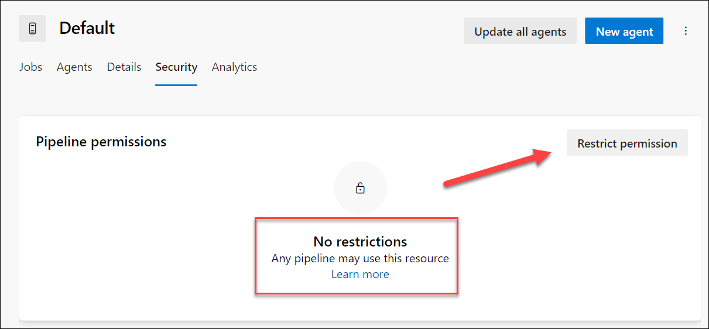

---
lab:
  title: Configuración y validación de permisos
  module: 'Module 4: Configure and validate permissions'
---

# Configuración y validación de permisos

En este laboratorio, configurará un entorno seguro que cumpla el principio de privilegios mínimos, lo que garantiza que los miembros solo puedan acceder a los recursos que necesitan para realizar sus tareas y minimizar los posibles riesgos de seguridad. Esto implica configurar y validar permisos de usuario y canalización y establecer comprobaciones de aprobación y ramificación en Azure DevOps.

Estos ejercicios duran aproximadamente **30** minutos.

## Antes de comenzar

Necesitará una suscripción de Azure, una organización de Azure DevOps y la aplicación eShopOnWeb para seguir los laboratorios.

- Siga los pasos para [validar el entorno de laboratorio](APL2001_M00_Validate_Lab_Environment.md).
- Instale un agente autohospedado siguiendo el laboratorio [Configuración de agentes y grupos de agentes para canalizaciones seguras](/Instructions/Labs/APL2001_M03_L03_Configure_Agents_And_Agent_Pools_for_Secure_Pipelines.md) o los pasos descritos en [Instalación de un agente autohospedado](https://docs.microsoft.com/azure/devops/pipelines/agents/v2-windows?view=azure-devops#install).

## Instrucciones

### Ejercicio 1: Importación de canalización de CI y configuración de permisos específicos de canalización

En este ejercicio, importará y ejecutará la canalización de CI para la aplicación eShopOnWeb y configurará los permisos específicos de la canalización.

#### Tarea 1: (Si ya la ha completado, omita esta tarea) Importar y ejecutar la canalización de CI

> [!NOTE]
> Omita la importación si ya se ha realizado en otro laboratorio.

Empiece por importar la canalización de CI denominada [eshoponweb-ci.yml](https://github.com/MicrosoftLearning/eShopOnWeb/blob/main/.ado/eshoponweb-ci.yml).

1. Vaya al portal de Azure DevOps en `https://dev.azure.com` y abra su organización.

1. Abra el proyecto **eShopOnWeb** .

1. Vaya a **Pipelines (Canalizaciones) > Pipelines (Canalizaciones)**.

1. Seleccione el botón **New Pipeline (Nueva canalización)**.

1. Seleccione **Git de Azure Repos (YAML)**.

1. Seleccione el repositorio **eShopOnWeb**.

1. Seleccione **Archivo YAML de Azure Pipelines existente**.

1. Seleccione el archivo **/.ado/eshoponweb-ci.yml** y seleccione **Continue (Continuar)**.

1. Haga clic en el botón **Run (Ejecutar)** para ejecutar la canalización.

1. La canalización tomará un nombre basado en el nombre del proyecto. Cámbielo para identificar mejor la canalización.

1. Vaya a **Pipelines (Canalizaciones) > Pipelines (Canalizaciones)**, seleccione la canalización creada recientemente, seleccione los puntos suspensivos y, después, seleccione la opción **Rename/move (Cambiar nombre/mover)**.

1. Asígnele el nombre **eshoponweb-ci** y seleccione **Guardar**.

### Tarea 2: Configuración y ejecución de la canalización con permisos específicos

En esta tarea, configurará la canalización de CI para que se ejecute con un grupo de agentes específico y validará los permisos para ejecutar la canalización. Debe tener permisos para editar la canalización y agregar permisos al grupo de agentes.

1. Vaya a Configuración del proyecto y seleccione **Grupos de agentes** en **Canalizaciones**.

1. Abra el grupo de agentes **Predeterminado**.

1. Seleccione la pestaña **Seguridad**.

1. Si no hay ninguna restricción en el grupo de agentes, seleccione el botón **Restringir permisos**.

    

1. Seleccione el botón **Agregar** y seleccione la canalización **eshoponweb-ci** para agregarla a la lista de canalizaciones con acceso al grupo de agentes.

1. Seleccione **Ejecutar** para ejecutar la canalización.

1. Abra la canalización en curso. Si ve el mensaje “This pipeline needs permission to access a resource before this run can continue to Build .Net Core Solution (Esta canalización necesita permiso para acceder a un recurso antes de que esta ejecución pueda continuar con la compilación de la solución .Net Core)”, seleccione **View (Ver)**, **Permit (Permitir)** y **Permit (Permitir)** de nuevo.

Deben poder ejecutar correctamente la canalización.

#### Tarea 3: (Si ya la ha completado, puede omitirla) Configuración de la canalización de CD y validación de los permisos

> [!NOTE]
> Omita la importación si ya se ha realizado en otro laboratorio.

> [!IMPORTANT]
> Si tiene permisos, podrá **permitir** que la canalización se ejecute directamente desde la canalización en ejecución. Si no tiene permisos, deberá usar otra cuenta con permisos de administración para permitir que la canalización se ejecute mediante el agente específico, tal como se describe en la tarea 2 anterior o para agregar permisos de usuario al grupo de agentes.

1. Vaya a **Pipelines (Canalizaciones) > Pipelines (Canalizaciones)**.

1. Seleccione el botón **New Pipeline (Nueva canalización)**.

1. Seleccione **Git de Azure Repos (YAML)**.

1. Seleccione el repositorio **eShopOnWeb**.

1. Seleccione **Archivo YAML de Azure Pipelines existente**.

1. Seleccione el archivo **/.ado/eshoponweb-cd-webapp-code.yml** y, después, seleccione **Continuar**.

1. En la definición de canalización de YAML, en la sección variables, personalice lo siguiente:
   - **YOUR-SUBSCRIPTION-ID** por el id. de la suscripción a Azure.
   - **az400eshop-NAME**, con un nombre de aplicación web que se va a implementar con un nombre único global, por ejemplo, **eshoponweb-lab-YOURNAME**.
   - **AZ400-EWebShop-NAME** con el nombre que prefiera, por ejemplo, **rg-eshoponweb**.

1. Actualice el archivo YAML para usar la imagen **windows-latest** en el grupo de agentes hospedado por Microsoft **predeterminado**. Para conseguirlo, establezca la sección **Grupo** en el siguiente valor:

    ```yaml
    pool: 
      vmImage: windows-latest

    ```

1. Haga clic en **Guardar** y después en **Ejecutar**.

1. Abra la canalización y verá el mensaje “This pipeline needs permission to access a resource before this run can continue to Deploy Web App (Esta canalización necesita permiso para acceder a un recurso antes de que esta ejecución pueda continuar con Implementar la aplicación web)”. Seleccione **Ver** y, después, **Permitir** para que la canalización pueda ejecutarse.

    

### Ejercicio 2: Configuración y validación de comprobaciones de aprobación y rama

En este ejercicio, configurará y validará las comprobaciones de aprobación y rama de la canalización de CD.

#### Tarea 1: Crear un nuevo entorno y agregar aprobaciones y comprobaciones

1. Vaya a **Canalizaciones > Entornos**.

1. Seleccione el botón **Crear entorno**.

1. Asigne al entorno el nombre **Test**, seleccione **Ninguno** como recurso y seleccione **Crear**.

1. Seleccione **Nuevo entorno**, cree un nuevo entorno llamado **Production**, seleccione **Ninguno** como recurso y seleccione **Crear**.

1. Abra el entorno de **Test**, seleccione ***...*** y seleccione **Aprobaciones y comprobaciones**.

1. Seleccione **Aprobaciones**.

1. En el cuadro de texto **Aprobadores**, escriba el nombre de usuario y, si tiene otro usuario, agréguelo para validar el proceso de aprobación.

1. Proporcione las instrucciones **Aprobar la implementación para Test** y seleccione **Crear**.

    

1. Seleccione el botón **+**, seleccione **Control de ramas** y, después, seleccione **Siguiente**.

1. En el campo **Ramas permitidas**, deje el valor predeterminado y seleccione **Crear**. Puede agregar más acciones si lo desea.

    

1. Abra el entorno **Production** y realice los mismos pasos para agregar aprobaciones y control de ramas. Para diferenciar los entornos, agregue las instrucciones **Aprobar la implementación en Production** y agregue la rama **refs/head/main** a las ramas permitidas.

1. (Opcional) Puede agregar más entornos y configurar aprobaciones y control de ramas para ellos. Además, puede configurar **Seguridad** para agregar usuarios o grupos al entorno.
    - Abra el entorno **Test**, seleccione ***...*** y seleccione **Seguridad**.
    - Seleccione **Agregar** y seleccione el usuario que ejecuta la canalización y el rol *Usuario*, *Creador* o *Lector*.
    - Seleccione **Agregar**.
    - Seleccione **Guardar**.

#### Tarea 2: Configuración de la canalización de CD para usar el nuevo entorno

1. Vaya a **Pipelines (Canalizaciones) > Pipelines (Canalizaciones)**.

1. Abra la canalización **eshoponweb-cd-webapp-code**.

1. Seleccione **Edit (Editar)**.

1. Encima del **#download artifacts**, agregue lo siguiente:

    ```yaml
    stages:
    - stage: Test
      displayName: Testing WebApp
      jobs:
      - deployment: Test
        pool:
          vmImage: 'windows-latest'
        environment: Test
        strategy:
          runOnce:
            deploy:
              steps:
              - script: echo Hello world! Testing environments!
    - stage: Deploy
    displayName: Deploy to WebApp
      jobs:
      - deployment: Deploy
        pool: 
          vmImage: windows-latest
        environment: Production
        strategy:
          runOnce:
            deploy:
              steps:
              - checkout: self
    ```

    > [!NOTE]
    > Tendrá que cambiar las líneas que siguen al código anterior a seis espacios a la derecha para asegurarse de que se cumplen las reglas de sangría de YAML.

    La canalización debe ser parecida a esta:

    

1. Seleccione **Guardar** y **Ejecutar**.

1. Abra la canalización y verá el mensaje “This pipeline needs permission to access a resource before this run can continue to Testing WebApp (Esta canalización necesita permiso para acceder a un recurso antes de que esta ejecución pueda seguir probando WebApp)”. Seleccione **Ver**, **Permitir** y **Permitir** de nuevo.

    

1. Abra la etapa **Prueba de WebApp** y verá que el mensaje **1 aprobación necesita su revisión antes de que esta ejecución pueda seguir probando WebApp**. Seleccione **Revisar** y seleccione **Aprobar**.

    

1. Espere a que finalice la canalización, abra el registro de canalización y compruebe que la etapa **Prueba de WebApp** se ejecutó correctamente.

    

1. Vuelva a la canalización y verá la etapa **Implementar en WebApp** esperando aprobación. Seleccione **Revisar** y **Aprobar** como hizo antes en la etapa **Prueba de WebApp**.

1. Espere a que la canalización termine y compruebe que la etapa **Implementar en WebApp** se ejecutó correctamente.

    

Debe poder ejecutar la canalización correctamente con las aprobaciones y comprobaciones de rama en ambos entornos, pruebas y producción.

### Ejercicio 3: Eliminación de los recursos del laboratorio de Azure

1. En Azure Portal, abra el grupo de recursos creado y haga clic en **Eliminar grupo de recursos** para todos los recursos creados de este laboratorio.

    

    > [!WARNING]
    > No olvide quitar los recursos de Azure recién creados que ya no use. La eliminación de los recursos sin usar garantiza que no verá cargos inesperados.

1. Restablezca los permisos específicos que agregó a la organización y el proyecto de Azure DevOps en este laboratorio.

## Revisar

En este laboratorio, ha aprendido a configurar un entorno seguro que cumpla el principio de privilegios mínimos, lo que garantiza que los miembros solo puedan acceder a los recursos que necesitan para realizar sus tareas y minimizar los posibles riesgos de seguridad. Ha configurado y validado permisos de usuario y canalización y establecido comprobaciones de aprobación y ramificación en Azure DevOps.
