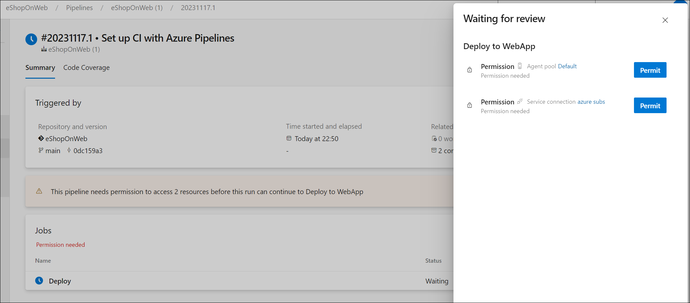
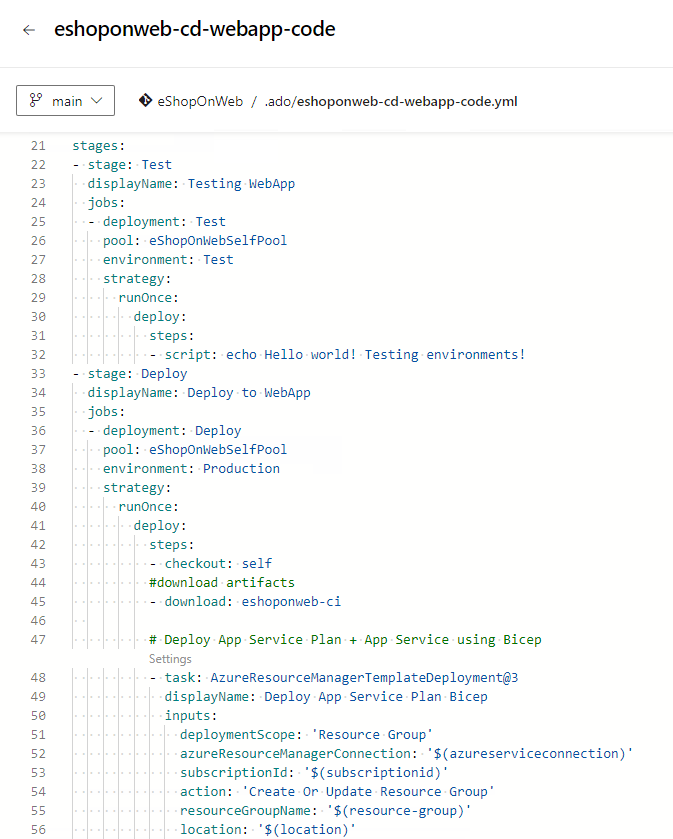

---
lab:
  title: Configurar y validar permisos
  module: 'Module 4: Configure and validate permissions'
---

# Configurar y validar permisos

En este laboratorio, configurará un entorno seguro que cumpla el principio de privilegios mínimos, lo que garantiza que los miembros solo puedan acceder a los recursos que necesitan para realizar sus tareas y minimizar los posibles riesgos de seguridad. Esto implica configurar y validar permisos de usuario y canalización y establecer comprobaciones de aprobación y ramificación en Azure DevOps.

Estos ejercicios duran aproximadamente **30** minutos.

## Antes de comenzar

Necesitará una suscripción de Azure, una organización de Azure DevOps y la aplicación eShopOnWeb para seguir los laboratorios.

- Siga los pasos para [validar el entorno de laboratorio](APL2001_M00_Validate_Lab_Environment.md).
- Instale un agente autohospedado siguiendo el laboratorio [Configuración de agentes y grupos de agentes para canalizaciones seguras](/Instructions/Labs/APL2001_M02_L02_Configure_Agents_And_Agent_Pools_for_Secure_Pipelines.md) o los pasos descritos en [Instalación de un agente autohospedado](https://docs.microsoft.com/azure/devops/pipelines/agents/v2-windows?view=azure-devops#install).

## Instrucciones

### Ejercicio 1: Importación de canalización de CI y configuración de permisos específicos de canalización

En este ejercicio, importará y ejecutará la canalización de CI para la aplicación eShopOnWeb y configurará los permisos específicos de la canalización.

#### Tarea 1:  Importar y ejecutar la canalización de CI

> [!NOTE]
> Empiece por importar la canalización de CI denominada [eshoponweb-ci.yml](https://github.com/MicrosoftLearning/eShopOnWeb/blob/main/.ado/eshoponweb-ci.yml).

1. Vaya al portal de Azure DevOps en `https://dev.azure.com` y abra su organización.

1. Abra el proyecto **eShopOnWeb** .

1. Vaya a **Pipelines (Canalizaciones) > Pipelines (Canalizaciones)**.

1. Seleccione **Nueva canalización**.

1. Selecciona **GIT de Azure Repos (YAML)**.

1. Selecciona el repositorio **eShopOnWeb**.

1. Seleccione **Archivo YAML de Azure Pipelines existente**.

1. Seleccione el archivo **/.ado/eshoponweb-ci.yml** y seleccione **Continue (Continuar)**.

1. Haga clic en el botón **Run (Ejecutar)** para ejecutar la canalización.

   > [!NOTE]
   > La canalización tomará un nombre basado en el nombre del proyecto. Cámbielo para identificar mejor la canalización.

1. Vaya a **Pipelines (Canalizaciones) > Pipelines (Canalizaciones)**, seleccione la canalización creada recientemente, seleccione los puntos suspensivos y, después, seleccione la opción **Rename/move (Cambiar nombre/mover)**.

1. Asígnele el nombre **eshoponweb-ci** y seleccione **Guardar**.

#### Tarea 2: Configuración y ejecución de la canalización con permisos específicos

> [!NOTE]
> Para usar el grupo de agentes configurado en esta tarea, primero deberá iniciar la máquina virtual de Azure que hospeda el agente. 

1. En el explorador, abra Azure Portal desde `https://portal.azure.com`.

1. En Azure Portal, vaya a la página que muestra la máquina virtual de Azure **eshoponweb-vm** que ha implementado en este laboratorio

1. En la página de la máquina virtual de Azure **eshoponweb-vm**, en la barra de herramientas, seleccione **Iniciar** para iniciarla.

   > [!NOTE]
   > A continuación, configurará la canalización de CI para que se ejecute con el grupo de agentes correspondiente y validará los permisos para ejecutar la canalización. Debe tener permisos para editar la canalización y agregar permisos al grupo de agentes.

1. Vaya a Configuración del proyecto y seleccione **Grupos de agentes** en **Canalizaciones**.

1. Abra el grupo de agentes **eShopOnWebSelfPool**.

1. Seleccione la pestaña **Seguridad**.

1. En la sección **Permisos de canalización**, seleccione el botón **+** y, luego, seleccione la canalización **eshoponweb-ci** para agregarla a la lista de canalizaciones con acceso al grupo de agentes.

1. Vaya a la página del proyecto **eShopOnWeb**.

1. En la página del proyecto **eShopOnWeb**, vaya a **Canalizaciones > Canalizaciones**.

1. Seleccione la canalización **eshoponweb-ci** y seleccione **Editar**.

1. En la subsección **trabajos** de la sección **fases**, actualice el valor de la propiedad **grupo** para hacer referencia al grupo de agentes autohospedados **eShopOnWebSelfPool** que configuró en esta tarea para que tenga el siguiente formato:

   ```yaml
     jobs:
     - job: Build
       pool: eShopOnWebSelfPool
       steps:
       - task: DotNetCoreCLI@2
   ```

1. Seleccione **Guardar** y elija confirmar directamente en la rama principal.

1. Seleccione **Guardar** otra vez.

1. Seleccione **Ejecutar** la canalización y, a continuación, haga clic en **Ejecutar** de nuevo.

1. Compruebe que el trabajo de compilación se ejecute en el agente **eShopOnWebSelfAgent** y se complete correctamente.

#### Tarea 3: Configurar la canalización de CD y validar permisos

1. En el portal de Azure DevOps, en la página del proyecto **eShopOnWeb**, vaya a **Canalizaciones > Canalizaciones**.

1. Selecciona **Nueva canalización**.

1. Selecciona **GIT de Azure Repos (YAML)**.

1. Selecciona el repositorio **eShopOnWeb**.

1. Seleccione **Archivo YAML de Azure Pipelines existente**.

1. Seleccione el archivo **/.ado/eshoponweb-cd-webapp-code.yml** y, después, seleccione **Continuar**.

1. En la definición de canalización de YAML, en la sección variables, personalice lo siguiente:

   - **AZ400-EWebShop-NAME** con el nombre que prefiera, por ejemplo, **rg-eshoponweb-perm**.
   - **Location** con el nombre de la región de Azure en la que desea implementar los recursos, por ejemplo, **southcentralus**.
   - **YOUR-SUBSCRIPTION-ID** por el id. de la suscripción a Azure.
   - **azure subs** con **azure subs managed**
   - **az400-webapp-NAME** con un nombre único global de la aplicación web que se va a implementar, por ejemplo, la cadena **eshoponweb-lab-perm-** seguida de un número aleatorio de seis dígitos. 

1. Actualice el archivo YAML para usar el grupo de agentes **eShopOnWebSelfPool**. Para ello, establezca la sección **grupo** en el siguiente valor:

   ```yaml
     jobs:
     - job: Deploy
       pool: eShopOnWebSelfPool
       steps:
       #download artifacts
       - download: eshoponweb-ci
   ```

1. Seleccione **Guardar y ejecutar** y, luego, seleccione **Guardar y ejecutar** de nuevo.

1. Abra la canalización y anote el mensaje "Esta canalización necesita permiso para acceder a 2 recursos antes de que esta ejecución pueda continuar con la implementación en WebApp". Seleccione **Ver** y, después, **Permitir** para que la canalización pueda ejecutarse.

   

1. Cambie el nombre de la canalización a **eshoponweb-cd-webapp-code**.

### Ejercicio 2: Configuración y validación de comprobaciones de aprobación y rama

En este ejercicio, configurará y validará las comprobaciones de aprobación y rama de la canalización de CD.

#### Tarea 1: Crear un entorno y agregar aprobaciones y comprobaciones

1. En el portal de Azure DevOps, en la página del proyecto **eShopOnWeb**, seleccione **Canalizaciones > Entornos**.

1. Seleccione **Crear entorno**.

1. Asigne al entorno el nombre **Test**, seleccione **Ninguno** como recurso y seleccione **Crear**.

1. Seleccione **Nuevo entorno**, cree el nuevo entorno **Producción**, asegúrese de que **Ninguno** esté seleccionado como recurso y seleccione **Crear**.

1. Abra el entorno de **Prueba** y seleccione la pestaña **Aprobaciones y comprobaciones**.

1. Seleccione **Aprobaciones**.

1. En el cuadro de texto **Aprobadores**, escriba su nombre de usuario.

1. Proporcione las instrucciones **Aprobar la implementación para probar** y seleccione **Crear**.

   

1. Seleccione el botón **+**, seleccione **Control de ramas** y, después, seleccione **Siguiente**.

1. En el campo **Ramas permitidas**, deje el valor predeterminado y seleccione **Crear**. Puede agregar más acciones si lo desea.

   

1. Cree otro entorno denominado **Producción** y realice los mismos pasos para agregar aprobaciones y el control de ramas. Para diferenciar los entornos, agregue las instrucciones **Aprobar la implementación en Production** y establezca las ramas permitidas en **refs/head/main**.

> [!NOTE]
> Puede agregar más entornos y configurar aprobaciones y control de ramas para ellos. Además, puede configurar **Seguridad** para agregar usuarios o grupos al entorno con roles como *Usuario*, *Creador* o *Lector*.

#### Tarea 2: Configuración de la canalización de CD para usar el nuevo entorno

1. En el portal de Azure DevOps, en la página del proyecto **eShopOnWeb**, seleccione **Canalizaciones > Canalizaciones**.

1. Abra la canalización **eshoponweb-cd-webapp-code**.

1. Seleccione **Editar**.

1. Reemplace las líneas 21 a 27 (directamente por encima del comentario **#download artifacts**) por el siguiente contenido:

   ```yaml
   stages:
   - stage: Test
     displayName: Testing WebApp
     jobs:
     - deployment: Test
       pool: eShopOnWebSelfPool
       environment: Test
       strategy:
         runOnce:
           deploy:
             steps:
             - script: echo Hello world! Testing environments!
   - stage: Deploy
     displayName: Deploy to WebApp
     jobs:
     - deployment: Deploy
       pool: eShopOnWebSelfPool
       environment: Production
       strategy:
         runOnce:
           deploy:
             steps:
             - checkout: self
   ```

   > [!NOTE]
   > Tendrá que desplazar todas las líneas que siguen al código anterior seis espacios a la derecha para asegurarse de que se cumplen las reglas de sangría de YAML.

   La canalización debe ser parecida a esta:

   

1. Seleccione **Guardar** (dos veces) y **Ejecutar** (dos veces).

1. Abra la fase **Prueba de WebApp** de la canalización y anote el mensaje **1 aprobación necesita su revisión antes de que esta ejecución pueda pasar a la prueba de WebApp**. Seleccione **Revisar** y seleccione **Aprobar**.

   

1. Espere a que finalice la canalización, abra el registro de canalización y compruebe que la etapa **Prueba de WebApp** se ejecutó correctamente.

   

1. Vuelva a la canalización y verá la etapa **Implementar en WebApp** esperando aprobación. Seleccione **Revisar** y **Aprobar** como hizo antes en la etapa **Prueba de WebApp**.

1. Espere a que finalice la canalización y compruebe que la fase **Implementación en WebApp** se ejecutó correctamente.

   

> [!NOTE]
> Debe poder ejecutar la canalización correctamente con las aprobaciones y comprobaciones de rama en ambos entornos, pruebas y producción.

### Ejercicio 3: Limpiar recursos de Azure y Azure DevOps

En este ejercicio, quitará los recursos de Azure y Azure DevOps creados en este laboratorio.

#### Tarea 1: Eliminación de recursos de Azure

1. En Azure Portal, vaya al grupo de recursos **rg-eshoponweb-perm** que contiene los recursos implementados y seleccione **Eliminar grupo de recursos** para eliminar todos los recursos creados en este laboratorio.

#### Tarea 2: Eliminación de canalizaciones de Azure DevOps

1. Vaya al portal de Azure DevOps en `https://dev.azure.com` y abra su organización.

1. Abra el proyecto **eShopOnWeb** .

1. Vaya a **Pipelines (Canalizaciones) > Pipelines (Canalizaciones)**.

1. Vaya a **Canalizaciones > Canalizaciones** y elimine las canalizaciones existentes.

#### Tarea 3: Volver a crear el repositorio de Azure DevOps

1. En el portal de Azure DevOps, en el proyecto **eShopOnWeb**, seleccione **Configuración del proyecto** en la esquina inferior izquierda.

1. En el menú vertical **Configuración del proyecto** en el lado izquierdo, en la sección **Repos**, seleccione**Repositorios**.

1. En el panel **Todos los repositorios**, mantenga el puntero sobre el extremo derecho de la entrada del repositorio **eShopOnWeb** hasta que aparezca el icono de puntos suspensivos de **Más opciones**; selecciónelo y, en el menú **Más opciones**, seleccione **Cambiar nombre**.  

1. En la ventana **Cambiar nombre del repositorio eShopOnWeb**, en el cuadro de texto **Nombre del repositorio**, escriba **eShopOnWeb_old** y seleccione **Cambiar nombre**.

1. Nuevamente en el panel **Todos los repositorios**, seleccione **+ Crear**.

1. En el panel **Crear un repositorio**, en el cuadro de texto **Nombre del repositorio**, escriba **eShopOnWeb**, desactive la casilla **Agregar un archivo LÉAME** y seleccione **Crear**.

1. De vuelta en el panel **Todos los repositorios**, mantenga el puntero sobre el extremo derecho de la entrada del repositorio **eShopOnWeb_old** hasta que aparezca el icono de puntos suspensivos **Más opciones**; selecciónelo y, en el menú **Más opciones**, seleccione **Eliminar**.  

1. En la ventana **Eliminar repositorio eShopOnWeb_old**, escriba **eShopOnWeb_old** y seleccione **Eliminar**.

1. En el menú de navegación izquierdo del portal de Azure DevOps, seleccione **Repositorios**.

1. En el panel **eShopOnWeb está vacío. Agregue código.**, seleccione **Importar un repositorio**.

1. En la ventana **Importar un repositorio de Git**, pegue la siguiente dirección URL `https://github.com/MicrosoftLearning/eShopOnWeb` y seleccione **Importar**:

## Revisar

En este laboratorio, ha aprendido a configurar un entorno seguro que cumpla el principio de privilegios mínimos, lo que garantiza que los miembros solo puedan acceder a los recursos que necesitan para realizar sus tareas y minimizar los posibles riesgos de seguridad. Ha configurado y validado permisos de usuario y canalización y establecido comprobaciones de aprobación y ramificación en Azure DevOps.
