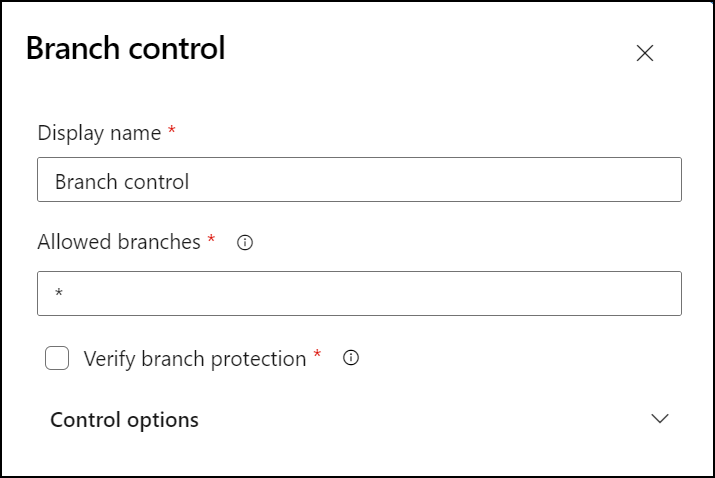
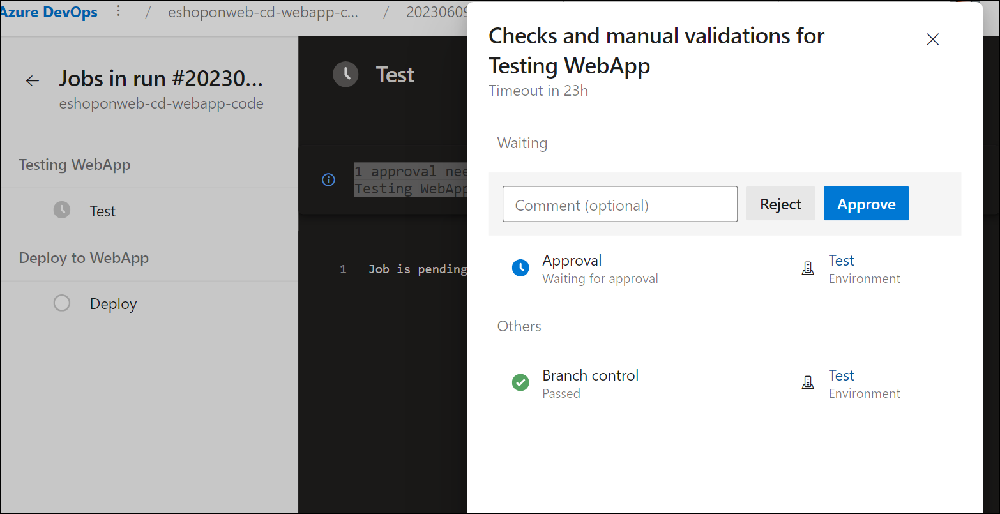

---
lab:
  title: Configurar y validar permisos
  module: 'Module 4: Configure and validate permissions'
---

# Configurar y validar permisos

En este laboratorio, configurará un entorno seguro que cumpla el principio de privilegios mínimos, lo que garantiza que los miembros solo puedan acceder a los recursos que necesitan para realizar sus tareas y minimizar los posibles riesgos de seguridad. Esto implica configurar y validar permisos de usuario y canalización y establecer comprobaciones de aprobación y ramificación en Azure DevOps.

Estos ejercicios duran aproximadamente **20** minutos.

## Antes de comenzar

Necesitará una suscripción de Azure, una organización de Azure DevOps y la aplicación eShopOnWeb para seguir los laboratorios.

- Siga los pasos para [validar el entorno de laboratorio](APL2001_M00_Validate_Lab_Environment.md).
- Instale un agente autohospedado siguiendo el laboratorio [Configuración de agentes y grupos de agentes para canalizaciones seguras](APL2001_M02_L02_Configure_Agents_And_Agent_Pools_for_Secure_Pipelines.md) o los pasos descritos en [Instalación de un agente autohospedado](https://learn.microsoft.com/azure/devops/pipelines/agents/windows-agent).

## Instrucciones

### Ejercicio 0: (omitir si ya lo has completado) importación y ejecución de canalizaciones de CI/CD

En este ejercicio, importarás y ejecutarás las canalizaciones de CI/CD en el proyecto de Azure DevOps.

#### Tarea 1: (omitir si ya la has completado) Importación y ejecución de la canalización de CI

Empecemos importando la canalización de CI denominada [eshoponweb-ci.yml](https://github.com/MicrosoftLearning/eShopOnWeb/blob/main/.ado/eshoponweb-ci.yml).

1. Vaya al portal de Azure DevOps en `https://aex.dev.azure.com` y abra su organización.

1. Abra el proyecto **eShopOnWeb** en Azure DevOps.

1. Vaya a **Pipelines (Canalizaciones) > Pipelines (Canalizaciones)**.

1. Seleccione el botón **Crear canalización**.

1. Seleccione **Git de Azure Repos (YAML)**.

1. Selecciona el repositorio **eShopOnWeb**.

1. Selecciona el **archivo YAML de Azure Pipelines existente**.

1. Seleccione el archivo **/.ado/eshoponweb-ci.yml** y haga clic en **Continuar**.

1. Haga clic en el botón **Run (Ejecutar)** para ejecutar la canalización.

   > **Nota**: la canalización adoptará un nombre en función del nombre del proyecto. Cambiará el nombre para identificar la canalización con más facilidad.

1. Vaya a **Pipelines (Canalizaciones) > Pipelines (Canalizaciones)** y seleccione la canalización creada recientemente. Seleccione los puntos suspensivos (...) y, a continuación, seleccione **Cambiar nombre/mover**.

1. Asígnele el nombre **eshoponweb-ci** y seleccione **Guardar**.

#### Tarea 2: (omitir si ya la has completado) Importación y ejecución de la canalización de CD

> **Nota**: en esta tarea, importarás y ejecutarás la canalización de CD denominada [eshoponweb-cd-webapp-code.yml](https://github.com/MicrosoftLearning/eShopOnWeb/blob/main/.ado/eshoponweb-cd-webapp-code.yml).

1. Vaya a **Pipelines (Canalizaciones) > Pipelines (Canalizaciones)**.

1. Seleccione el botón **New Pipeline (Nueva canalización)**.

1. Seleccione **Git de Azure Repos (YAML)**.

1. Selecciona el repositorio **eShopOnWeb**.

1. Seleccione **Archivo YAML de Azure Pipelines existente**.

1. Seleccione el archivo **/.ado/eshoponweb-cd-webapp-code.yml** y, después, seleccione **Continuar**.

1. En la definición de canalización de YAML, establezca la sección variables de la siguiente manera:

   ```yaml
   variables:
     resource-group: 'YOUR-RESOURCE-GROUP-NAME'
     location: 'centralus'
     templateFile: 'infra/webapp.bicep'
     subscriptionid: 'YOUR-SUBSCRIPTION-ID'
     azureserviceconnection: 'YOUR-AZURE-SERVICE-CONNECTION-NAME'
     webappname: 'YOUR-WEB-APP-NAME'
   ```

1. Reemplace los valores de las variables por los valores correctos de su entorno:

   - Reemplaza **YOUR-RESOURCE-GROUP-NAME** por el nombre del grupo de recursos que deseas usar en este laboratorio, por ejemplo, **rg-eshoponweb-multi**.
   - Establece el valor de la variable **location** en el nombre de la región de Azure en la que quieres implementar los recursos, por ejemplo, **centralus**.
   - Reemplaza **YOUR-SUBSCRIPTION-ID** por tu identificador de suscripción a Azure.
   - Reemplaza **YOUR-AZURE-SERVICE-CONNECTION-NAME** por **azure subs**
   - Reemplaza **YOUR-WEB-APP-NAME** por un nombre único global de la aplicación web que se va a implementar, por ejemplo, la cadena **eshoponweb-lab-multi-123456** seguida de un número aleatorio de seis dígitos.

1. Selecciona **Guardar y ejecutar** y elige "commit" directamente en la rama principal.

1. Seleccione **Save and Run (Guardar y ejecutar)** de nuevo.

1. Abra la ejecución de la canalización. Si ves el mensaje “Esta canalización necesita permiso para acceder a un recurso antes de que esta ejecución pueda continuar con Implementar en WebApp”, selecciona **Ver**, **Permitir** y **Permitir** de nuevo. Esto es necesario para permitir que la canalización cree el recurso de Azure App Service.

   

1. La implementación puede tardar unos minutos en completarse, espera a que se ejecute la canalización. La canalización se desencadena después de la finalización de la canalización de CI e incluye las siguientes tareas:

   - **AzureResourceManagerTemplateDeployment**: Implementa la aplicación web de Azure App Service mediante una plantilla de Bicep.
   - **AzureRmWebAppDeployment**: Publica el sitio web en la aplicación web de Azure App Service.

   > **Nota**: en caso de que se produzca un error en la implementación, ve a la página de ejecución de la canalización y selecciona **Volver a ejecutar trabajos con errores** para invocar otra ejecución de canalización.

   > **Nota**: la canalización adoptará un nombre en función del nombre del proyecto. Vamos a **cambiarle el nombre** para identificar mejor la canalización.

1. Ve a **Canalizaciones > Canalizaciones** y selecciona la canalización creada recientemente. Selecciona los puntos suspensivos (...) y, a continuación, selecciona **Cambiar nombre/mover**.

1. Asígnale el nombre **eshoponweb-cd-webapp-code** y haz clic en **Guardar**.

### Ejercicio 1: Configuración y validación de comprobaciones de aprobación y rama

En este ejercicio, configurarás y validarás las comprobaciones de aprobación y rama de la canalización de CD.

#### Tarea 1: Creación de un entorno y adición de aprobaciones y comprobaciones

1. En el portal de Azure DevOps, en la página del proyecto **eShopOnWeb**, selecciona **Canalizaciones > Entornos**.

1. Selecciona **Crear entorno**.

1. Asigna al entorno el nombre **Pruebas**, selecciona **Ninguno** como recurso y selecciona **Crear**.

1. Abre el entorno de **Pruebas** y selecciona la pestaña **Aprobaciones y comprobaciones**.

1. Selecciona **Aprobaciones**.

1. En el cuadro de texto **Aprobadores**, escribe tu nombre de usuario.

1. Si no está habilitado, activa la casilla "Permitir que los aprobadores aprueben sus propias ejecuciones".

1. Proporciona las instrucciones **Aprobar la implementación para probar** y selecciona **Crear**.

   

1. Haz clic en el botón **+ Agregar nuevo**, selecciona **Control de ramas** y, después, selecciona **Siguiente**.

1. En el campo **Ramas permitidas**, deja el valor predeterminado y selecciona **Crear**. Puedes agregar más acciones si lo deseas.

   

1. Crea otro entorno denominado **Producción** y realiza los mismos pasos para agregar aprobaciones y el control de ramas. Para diferenciar los entornos, agrega las instrucciones **Aprobar la implementación en Producción** y establece las ramas permitidas en **refs/head/main**.

> **Nota**: puedes agregar más entornos y configurar aprobaciones y control de ramas para ellos. Además, puedes configurar **Seguridad** para agregar usuarios o grupos al entorno con roles como *Usuario*, *Creador* o *Lector*.

#### Tarea 2: Configuración de la canalización de CD para usar el nuevo entorno

1. En el portal de Azure DevOps, en la página del proyecto **eShopOnWeb**, selecciona **Canalizaciones > Canalizaciones**.

1. Abre la canalización **eshoponweb-cd-webapp-code**.

1. Selecciona **Editar**.

1. Selecciona la línea situada encima del comentario **#download artifacts**, hasta la línea **stages:** del archivo YAML de canalización y reemplaza el contenido por el código siguiente:

   ```yaml
   stages:
   - stage: Test
     displayName: Testing WebApp
     jobs:
     - deployment: Test
       pool: eShopOnWebSelfPool
       environment: Test
       strategy:
         runOnce:
           deploy:
             steps:
             - script: echo Hello world! Testing environments!
   - stage: Deploy
     displayName: Deploy to WebApp
     jobs:
     - deployment: Deploy
       pool: eShopOnWebSelfPool
       environment: Production
       strategy:
         runOnce:
           deploy:
             steps:
             - checkout: self
   ```

   > **Nota**: tendrá que desplazar todas las líneas que siguen al código anterior seis espacios a la derecha para asegurarte de que se cumplen las reglas de sangría de YAML.

   La canalización debe ser parecida a esta:

   

   > [!IMPORTANT]
   > Confirma que el nombre del **grupo** es el mismo que el que creaste en el laboratorio anterior.

1. Haz clic en **Validar y guardar**, elige hacer "commit" directamente en la rama principal y, a continuación, haz clic en **Guardar**.

1. La canalización se desencadenará automáticamente. Abre la ejecución de la canalización.

   > **Nota**: si ves el mensaje “Esta canalización necesita permiso para acceder a un recurso antes de que esta ejecución pueda continuar con Implementar en WebApp”, selecciona **Ver**, **Permitir** y **Permitir** de nuevo.

1. Abre la fase **Prueba de WebApp** de la canalización y anota el mensaje **1 aprobación necesita su revisión antes de que esta ejecución pueda pasar a la prueba de WebApp**. Selecciona **Revisar** y selecciona **Aprobar**.

   

1. Espera a que finalice la canalización, abre el registro de canalización y comprueba que la fase **Prueba de WebApp** se haya ejecutado correctamente.

   

1. Vuelve a la canalización y verás la etapa **Implementar en WebApp** esperando aprobación. Selecciona **Revisar** y **Aprobar** como hiciste antes en la fase **Prueba de WebApp**.

   > **Nota**: si ves el mensaje “Esta canalización necesita permiso para acceder a un recurso antes de que esta ejecución pueda continuar con Implementar en WebApp”, selecciona **Ver**, **Permitir** y **Permitir** de nuevo.

1. Espera a que finalice la canalización y comprueba que la fase **Implementación en WebApp** se haya ejecutado correctamente.

   

> **Nota**: debes poder ejecutar la canalización correctamente con las aprobaciones y comprobaciones de rama en ambos entornos, pruebas y producción.

> [!IMPORTANT]
> Recuerda eliminar los recursos creados en Azure Portal para evitar cargos innecesarios.

## Revisión

En este laboratorio, has aprendido a configurar un entorno seguro que cumpla el principio de privilegios mínimos, lo que garantiza que los miembros solo puedan acceder a los recursos que necesitan para realizar sus tareas y minimizar los posibles riesgos de seguridad. Has configurado y validado permisos de usuario y canalización y establecido comprobaciones de aprobación y rama en Azure DevOps.
