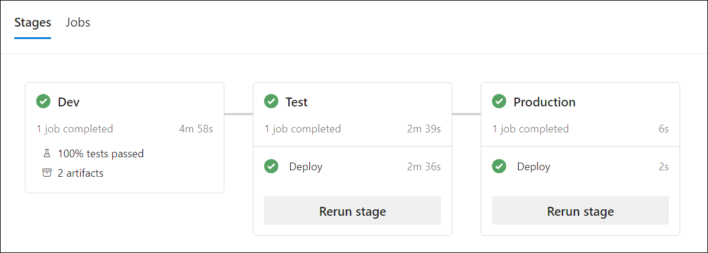

---
lab:
  title: Extensión de una canalización para usar varias plantillas
  module: 'Module 5: Extend a pipeline to use multiple templates'
---

# Extensión de una canalización para usar varias plantillas

En este laboratorio, explorará la importancia de extender una canalización a varias plantillas y cómo hacerlo mediante Azure DevOps. En este laboratorio se tratan conceptos básicos y procedimientos recomendados para crear una canalización de varias fases, crear una plantilla de variables, crear una plantilla de trabajo y crear una plantilla de fase.

Estos ejercicios duran aproximadamente **20** minutos.

## Antes de comenzar

Necesitará una suscripción de Azure, una organización de Azure DevOps y la aplicación eShopOnWeb para seguir los laboratorios.

- Siga los pasos para [validar el entorno de laboratorio](APL2001_M00_Validate_Lab_Environment.md).

## Instrucciones

### Ejercicio 1: Creación de canalizaciones YAML de varias etapas

#### Tarea 1: Creación de una canalización YAML principal de varias etapas

1. Vaya al portal de Azure DevOps en `https://dev.azure.com` y abra su organización.

1. Abra el proyecto **eShopOnWeb** .

1. Vaya a **Pipelines (Canalizaciones) > Pipelines (Canalizaciones)**.

1. Seleccione el botón **New Pipeline (Nueva canalización)**.

1. Seleccione **Git de Azure Repos (YAML)**.

1. Seleccione el repositorio **eShopOnWeb**.

1. Seleccione **Canalización inicial**.

1. Reemplace el contenido del archivo **azure-pipelines.yml** por el código siguiente:

    ```YAML
    trigger:
    - main

    pool:
      vmImage: 'windows-latest'

    stages:
    - stage: Dev
      jobs:
      - job: Build
        steps:
        - script: echo Build
    - stage: Test
      jobs:
      - job: Test
        steps:
        - script: echo Test
    - stage: Production
      jobs:
      - job: Deploy
        steps:
        - script: echo Deploy

    ```

1. Seleccione **Guardar y ejecutar**. Elija si desea confirmar directamente en la rama principal o crear una nueva rama. Seleccione el botón **Guardar y ejecutar**.

   > [!NOTE]
   > Si decide crear una rama, deberá crear una solicitud de incorporación de cambios para combinar los cambios en la rama principal.

1. Verá la canalización que se ejecuta con las tres etapas (Dev, Test y Production) y los trabajos correspondientes. Espere hasta que finalice la canalización y vuelva a la página **Pipelines (Canalizaciones)**.

    

1. Seleccione **...** (Más opciones) en el lado derecho de la canalización que acaba de crear y seleccione **Rename/move (Cambiar nombre/mover)**.

1. Cambie el nombre de la canalización a **eShopOnWeb-MultiStage-Main** y seleccione **Save (Guardar)**.

#### Tarea 2: Creación de una plantilla de variables

1. Vaya a **Repos > Files (Repositorio > Archivos)**.

1. Expanda la carpeta **.ado** y haga clic en **New file (Nuevo archivo)**.

1. Asigne al archivo el nombre **eshoponweb-variables.yml** y haga clic en **Create (Crear)**.

1. Agregue el siguiente código al archivo:

    ```YAML
    variables:
      resource-group: 'YOUR-RESOURCE-GROUP-NAME'
      location: 'southcentralus' #name of the Azure region you want to deploy your resources
      templateFile: '.azure/bicep/webapp.bicep'
      subscriptionid: 'YOUR-SUBSCRIPTION-ID'
      azureserviceconnection: 'YOUR-AZURE-SERVICE-CONNECTION-NAME'
      webappname: 'YOUR-WEB-APP-NAME'

    ```

    > [!IMPORTANT]
    > Reemplace los valores de las variables por los valores del entorno (grupo de recursos, ubicación, identificador de suscripción, conexión de servicio de Azure y nombre de la aplicación web).

1. Seleccione **Commit (Confirmar)**, deje un comentario y seleccione **(Commit) Confirmar** de nuevo.

#### Tarea 3: Preparación de la canalización para usar plantillas

1. Vaya a **Pipelines (Canalizaciones) > Pipelines (Canalizaciones)**.

1. Abra la canalización **eShopOnWeb-MultiStage-Main**.

1. Seleccione **Edit (Editar)**.

1. Reemplace el contenido del archivo **azure-pipelines.yml** por el código siguiente:

    ```YAML
    trigger:
    - main
    variables:
    - template: .ado/eshoponweb-variables.yml
    
    stages:
    - stage: Dev
      jobs:
      - template: .ado/eshoponweb-ci.yml
    - stage: Test
      jobs:
      - template: .ado/eshoponweb-cd-webapp-code.yml
    - stage: Production
      jobs:
      - job: Deploy
        steps:
        - script: echo Deploy to Production or Swap

    ```

1. Guarde la canalización.

1. Elija si desea confirmar directamente en la rama principal o crear una nueva rama. Seleccione el botón **Guardar**.

   > [!NOTE]
   > Si decide crear una rama, deberá crear una solicitud de incorporación de cambios para combinar los cambios en la rama principal.

#### Tarea 4: Actualización de plantillas de CI/CD

1. Vaya a **Pipelines (Canalizaciones) > Pipelines (Canalizaciones)**.

1. Edite la canalización **eshoponweb-ci**.

1. Quite todo lo que está encima de la sección **jobs (trabajos)**.

    ```YAML
    #NAME THE PIPELINE SAME AS FILE (WITHOUT ".yml")
    # trigger:
    # - main
    
    resources:
      repositories:
        - repository: self
          trigger: none
    
    stages:
    - stage: Build
      displayName: Build .Net Core Solution

    ```

1. Guarde la canalización.

1. Vaya a **Pipelines (Canalizaciones) > Pipelines (Canalizaciones)**.

1. Edite la canalización **eshoponweb-cd-webapp-code**.

1. Quite todo lo que está encima de la sección **jobs (trabajos)**.

    ```YAML
    #NAME THE PIPELINE SAME AS FILE (WITHOUT ".yml")
    
    # Trigger CD when CI executed successfully
    resources:
      pipelines:
        - pipeline: eshoponweb-ci
          source: eshoponweb-ci # given pipeline name
          trigger: true

    variables:
      resource-group: 'rg-eshoponweb'
      location: 'southcentralus'
      templateFile: '.azure/bicep/webapp.bicep'
      subscriptionid: ''
      azureserviceconnection: 'azure subs'
      webappname: 'eshoponweb-lab'
      # webappname: 'webapp-windows-eshop'
    
    stages:
    - stage: Deploy
      displayName: Deploy to WebApp`

    ```

1. Actualice el paso **download (descarga)** a lo siguiente:

    ```YAML
    - download: current
      artifact: Website
    - download: current
      artifact: Bicep
    ```

1. Guarde la canalización.

1. (Opcional) Actualice el paso de producción para implementar la aplicación en otro entorno o cambie las ranuras de implementación.

#### Tarea 5: Ejecución de la canalización principal

1. Vaya a **Pipelines (Canalizaciones) > Pipelines (Canalizaciones)**.

1. Abra la canalización **eShopOnWeb-MultiStage-Main**.

1. Seleccione **Run pipeline** (Ejecutar canalización).

1. Espere hasta que finalice la canalización y compruebe los resultados.

    

### Ejercicio 2: Eliminación de los recursos del laboratorio de Azure

1. En Azure Portal, abra el grupo de recursos creado y seleccione **Eliminar grupo de recursos** para todos los recursos creados de este laboratorio.

    

    > [!WARNING]
    > No olvide quitar los recursos de Azure recién creados que ya no use. La eliminación de los recursos sin usar garantiza que no verá cargos inesperados.

## Revisar

En este módulo, aprendió la importancia de extender una canalización a varias plantillas y cómo hacerlo mediante Azure DevOps. En este laboratorio se han tratado conceptos básicos y procedimientos recomendados para crear una canalización de varias etapas, crear una plantilla de variables, crear una plantilla de trabajo y crear una plantilla de etapa.
