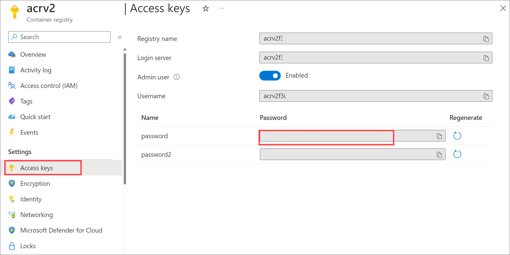
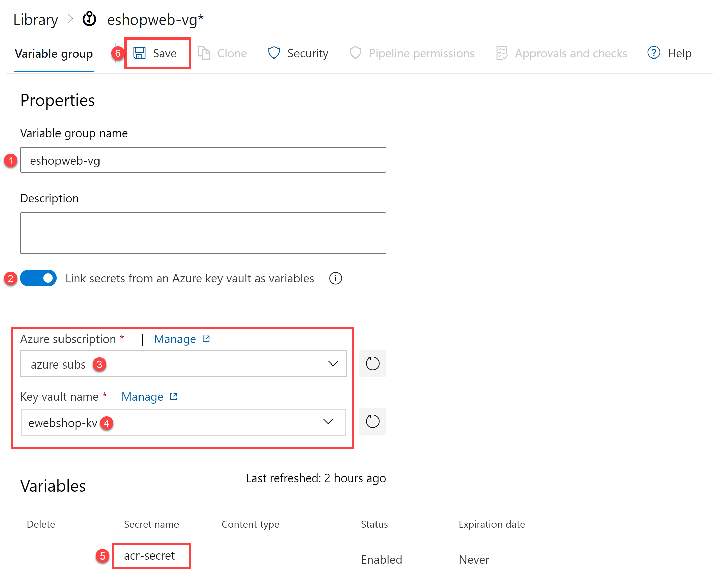

---
lab:
  title: "Integración de Azure\_Key\_Vault con Azure Pipelines"
  module: 'Module 6: Configure secure access to Azure Repos from pipelines'
---

# Integración de Azure Key Vault con Azure Pipelines

Azure Key Vault proporciona un almacenamiento y una administración seguros de los datos confidenciales, como claves, contraseñas y certificados. Azure Key Vault incluye compatibilidad con módulos de seguridad de hardware y una gama de algoritmos de cifrado y longitudes de clave. El uso de Azure Key Vault puede minimizar la posibilidad de revelar datos confidenciales desde el código fuente, un error habitual que cometen los desarrolladores. El acceso a Azure Key Vault requiere una autenticación y autorización adecuadas, y admite permisos específicos para su contenido.

En este laboratorio, verás cómo puedes integrar Azure Key Vault con una canalización de Azure Pipelines mediante los pasos siguientes:

- Crear un almacén de Azure Key Vault para almacenar una contraseña ACR como secreto.
- Configurar los permisos para permitir que la entidad de servicio lea el secreto.
- Configurar la canalización para recuperar la contraseña de Azure Key Vault y pasarla a las tareas posteriores.

Estos ejercicios duran aproximadamente **30** minutos.

## Antes de comenzar

Necesitarás una suscripción a Azure, una organización de Azure DevOps y la aplicación eShopOnWeb para seguir los laboratorios.

- Sigue los pasos para [validar el entorno de laboratorio](APL2001_M00_Validate_Lab_Environment.md).

En este laboratorio, aprenderás a:

- Implementar recursos en tu suscripción de Azure.
- Obtener acceso de lectura a los secretos de Azure Key Vault.

## Instrucciones

### Ejercicio 1: Configuración de la canalización de CI para crear el contenedor eShopOnWeb.

En este ejercicio, configurarás una canalización de YAML de CI para lo siguiente:

- Crear una instancia de Azure Container Registry para almacenar las imágenes de contenedor
- Uso de Docker Compose para compilar e insertar imágenes de contenedor **eshoppublicapi** y **eshopwebmvc**. Solo se implementará el contenedor **eshopwebmvc**.

#### Tarea 1: Configuración y ejecución de la canalización de CI

En esta tarea, importarás una definición de canalización de YAML de CI existente, la modificarás y la ejecutarás. La canalización creará una instancia de Azure Container Registry (ACR) y compilará/publicará las imágenes de contenedor eShopOnWeb.

1. Ve al portal de Azure DevOps en `https://aex.dev.azure.com` y abre tu organización.

1. Ve al proyecto **eShopOnWeb** de Azure DevOps. Ve a **Canalizaciones > Canalizaciones** y selecciona **Nueva canalización**.

1. En la página **¿Dónde está su código?**, selecciona **Git de Azure Repos (YAML)** y selecciona el repositorio **eShopOnWeb**.

1. En la página **Configurar la canalización**, selecciona **Archivo YAML de Azure Pipelines existente**. Proporciona la siguiente ruta de acceso **/.ado/eshoponweb-ci-dockercompose.yml** y selecciona **Continuar**.

   

1. En la definición de canalización de YAML, en la sección de variables, realiza las siguientes acciones:

   - Reemplaza **AZ400-EWebShop-NAME** por **rg-eshoponweb-docker**
   - Establece el valor de la variable de ubicación en el nombre de una región de Azure que hayas usado en los laboratorios anteriores de este curso (por ejemplo, **centralus**)
   - Reemplaza **YOUR-SUBSCRIPTION-ID** por tu identificador de suscripción a Azure

1. Selecciona **Guardar y ejecutar** y elige hacer "commit" directamente en la rama principal.

1. Selecciona **Guardar y ejecutar** de nuevo.

   > **Nota**: si decides crear una nueva rama, deberás crear una solicitud de cambios para combinar los cambios en la rama principal.

1. Abre la canalización. Si ves el mensaje “Esta canalización necesita permiso para acceder a un recurso antes de que esta ejecución pueda continuar con Crear ACR para imágenes”, selecciona **Ver**, **Permitir** y **Permitir** de nuevo. La canalización se ejecutará en unos minutos.

   

1. Espera a que se complete la ejecución de canalización. Esto puede tardar unos minutos. La canalización de compilación está formada por las siguientes tareas:

     - **AzureResourceManagerTemplateDeployment** usa **Bicep** para crear una instancia de Azure Container Registry.
     - La tarea de **PowerShell** toma la salida de Bicep (servidor de inicio de sesión acr) y crea una variable de canalización.
     - La tarea **DockerCompose** compila e inserta las imágenes de contenedor para eShopOnWeb en Azure Container Registry.

1. La canalización recibirá de manera predeterminada el nombre en función del nombre del proyecto. Cambia el nombre a **eshoponweb-ci-dockercompose** para identificar mejor la canalización.

1. Una vez completada la ejecución de canalización, usa el explorador web para ir a Azure Portal, abre el grupo de recursos **rg-eshoponweb-docker** y selecciona la entrada que representa a Azure Container Registry (ACR) implementada por la canalización.

   > **Nota**: para ver los repositorios en el registro, debes conceder a tu cuenta de usuario un rol que proporcione dicho acceso. Usarás para este propósito el rol AcrPull.

1. En la página Registro de contenedor, selecciona **Control de acceso (IAM)**, selecciona **+ Agregar** y, en la lista desplegable, selecciona **Agregar asignación de rol**.

1. En la pestaña **Rol** de la página **Agregar asignación de roles**, selecciona **AcrPull** y, a continuación, selecciona **Siguiente**.

1. En la pestaña **Miembros**, haz clic en **+ Seleccionar miembros**, selecciona tu cuenta de usuario, haz clic en **Seleccionar** y, a continuación, selecciona **Siguiente**.

1. Selecciona **Revisar y asignar** y, una vez completada correctamente la asignación, actualiza la página del explorador.

1. De nuevo en la página Registro de contenedor, en la barra de menús vertical de la izquierda, en la sección **Servicios**, selecciona **Repositorios**.

1. Comprueba que el registro contiene las imágenes **eshoppublicapi** y **eshopwebmvc**. Solo usarás **eshopwebmvc** en la fase de implementación.

   

1. En **Configuración**, selecciona **Claves de acceso**, habilita la casilla **Usuario administrador** y copia los valores de **nombre de usuario** y **Nombre de registro**, que se usarán en la siguiente tarea, ya que los agregarás como secreto a Azure Key Vault.

   

1. En la misma página, registra el valor de **Nombre del registro**. Lo necesitarás más adelante en este laboratorio.

#### Tarea 2: Creación de Azure Key Vault

En esta tarea, crearás Azure Key Vault mediante Azure Portal.

En este escenario de laboratorio, habrá una instancia de Azure Container Instance (ACI) que extrae y ejecuta una imagen de contenedor almacenada en Azure Container Registry (ACR). Tenemos previsto almacenar la contraseña de ACR como un secreto en Azure Key Vault.

1. En Azure Portal, en el cuadro de texto **Buscar recursos, servicios y documentos**, escribe **Almacenes de claves** y presiona la tecla **Entrar**.

1. Selecciona la hoja **Almacenes de claves** y haz clic en **Crear almacén de claves**.

1. En la pestaña **Datos básicos** de la hoja **Crear almacén de claves**, especifica la siguiente configuración y selecciona **Siguiente**:

   | Configuración | Valor |
   | --- | --- |
   | Suscripción | Nombre de la suscripción a Azure que usas en este laboratorio |
   | Grupo de recursos | el nombre del grupo de recursos **rg-eshoponweb-secure** |
   | Nombre del almacén de claves | cualquier nombre válido único, como **ewebshop-kv** |
   | Región | la misma región de Azure que elegiste anteriormente en este laboratorio |
   | Plan de tarifa | **Estándar** |
   | Días durante los cuales se conservarán los almacenes eliminados | **7**
           |
   | Protección de purgas | **Deshabilitación de la protección de purga** |

1. Haz clic en **Siguiente: Configuración de acceso**.

1. Selecciona **Directiva de acceso al almacén** en la sección **Modelo de permisos**.

1. En la sección **Directivas de acceso**, selecciona **+ Crear** para configurar una nueva directiva.

   > **Nota**: debes proteger el acceso a los almacenes de claves permitiendo el acceso únicamente a aplicaciones y usuarios autorizados. Para acceder a los datos del almacén, deberás facilitar permisos de lectura (Obtener o Enumerar) a la entidad de servicio creada anteriormente que usarás para la autenticación en la canalización.

   - En la hoja **Permiso**, marca los permisos **Obtener** y **Enumerar** en de **Permiso secreto**. Selecciona **Siguiente**.
   - En la hoja **Entidad de seguridad**, busca y selecciona el usuario, selecciona **Siguiente** y **Siguiente** de nuevo.
   - En la hoja **Revisar y crear**, selecciona **Crear**.

1. De nuevo en la hoja **Crear un almacén de claves**, selecciona **Revisar y crear > Crear**.

   > **Nota**: espera a que se aprovisione Azure Key Vault Debería tardar menos de un minuto.

1. En el hoja **Se completó la implementación**, haz clic en **Ir al recurso**.

1. En la hoja Azure Key Vault, en el menú vertical del lado izquierdo de la hoja, en la sección **Objetos**, selecciona **Secretos**.

1. En la hoja **Secretos**, selecciona **Generar/importar**.

1. En la hoja **Crear un secreto**, especifica las opciones siguientes y selecciona **Crear** (deja las demás con los valores predeterminados):

   | Configuración | Valor |
   | --- | --- |
   | Opciones de carga | **Manual** |
   | Nombre | **acr-secret** |
   | Value | Contraseña de acceso de ACR copiada en la tarea anterior |

1. Espera a que se cree el secreto.

#### Tarea 3: Creación de un grupo de variables conectado a Azure Key Vault

En esta tarea, crearás un grupo de variables en Azure DevOps que recuperará el secreto de contraseña de ACR de Key Vault mediante la Conexión de servicio (entidad de servicio).

1. Ve al portal de Azure DevOps en `https://aex.dev.azure.com` y abre tu organización.

1. Ve al proyecto **eShopOnWeb** de Azure DevOps.

1. En el panel de navegación vertical del portal de Azure DevOps, selecciona **Canalizaciones > Biblioteca**. Selecciona **+ Grupo de variables**.

1. En la hoja **Nuevo grupo de variables**, configura las opciones siguientes:

   | Configuración | Valor |
   | --- | --- |
   | Nombre del grupo de variables | **eshopweb-vg** |
   | Vincular secretos del almacén de claves de Azure como variables | **enable** |
   | Suscripción a Azure | **Conexión de servicio de Azure disponible > suscripciones a Azure** |
   | Nombre del almacén de claves | el nombre que asignaste a la instancia de Azure Key Vault en la tarea anterior |

1. Haz clic en el botón **Autorizar**.

1. En **Variables**, selecciona **+ Agregar** y selecciona el secreto **acr-secret**. Selecciona **Aceptar**.

1. Selecciona **Guardar**.

   

#### Tarea 4: Configuración de la canalización de CD para implementar el contenedor en Azure Container Instance (ACI)

En esta tarea, importarás una canalización de CD, la personalizarás y ejecutarás para implementar la imagen de contenedor creada antes en una instancia de contenedor de Azure.

1. En el portal de Azure DevOps que muestra el proyecto **eShopOnWeb**, selecciona **Canalizaciones > Canalizaciones** y, a continuación, selecciona **Nueva canalización**.

1. En la página **¿Dónde está su código?**, selecciona **Git de Azure Repos (YAML)** y, a continuación, selecciona el repositorio **eShopOnWeb**.

1. En la página **Configurar la canalización**, selecciona **Archivo YAML de Azure Pipelines existente**. Proporciona la ruta de acceso **/.ado/eshoponweb-cd-aci.yml** y selecciona **Continuar**.

1. En la definición de canalización de YAML, en la sección de variable, realiza las siguientes acciones:

   - Establece el valor de la variable de ubicación en el nombre de una región de Azure que usaste anteriormente en este laboratorio, por ejemplo **centralus**.
   - Reemplaza **YOUR-SUBSCRIPTION-ID** por tu identificador de suscripción a Azure
   - Reemplaza **az400eshop-NAME** por un nombre único global de la instancia de contenedor de Azure que se va a implementar, por ejemplo, la cadena **eshoponweb-lab-docker,** seguida de un número aleatorio de seis dígitos.
   - Reemplaza **YOUR-ACR** y **ACR-USERNAME** por el nombre del registro de ACR que registraste anteriormente en este laboratorio.
   - Reemplaza **AZ400-EWebShop-NAME** por el nombre del grupo de recursos que creaste anteriormente en este laboratorio (**rg-eshoponweb-secure**).

1. Selecciona **Guardar y ejecutar** y, a continuación, selecciona **Guardar y ejecutar** de nuevo.

1. Abre la canalización y observa el mensaje "Esta canalización necesita permiso para acceder a 2 recursos antes de que esta ejecución pueda continuar con Docker Compose a ACI". Selecciona **Ver** y, a continuación, selecciona **Permitir** dos veces (para cada recurso) para permitir que se ejecute la canalización.

1. Espera a que se complete la ejecución de canalización. Esto puede tardar unos minutos. La definición de compilación consta de una sola tarea **AzureResourceManagerTemplateDeployment**, que implementa la instancia de contenedor de Azure (ACI) mediante una plantilla de Bicep y proporciona los parámetros de inicio de sesión de ACR para permitir que ACI descargue la imagen de contenedor creada anteriormente.

1. La canalización tomará un nombre en función del nombre del proyecto. Cambia el nombre a **eshoponweb-cd-aci** para facilitar la identificación de su propósito.

> [!IMPORTANT]
> Recuerda eliminar los recursos creados en Azure Portal para evitar cargos innecesarios.

## Revisión

En este laboratorio, has integrado Azure Key Vault con una canalización de Azure DevOps siguiendo estos pasos:

- Proporcionaste acceso a los secretos de Azure Key Vault y a los recursos de Azure desde Azure DevOps.
- Ejecutaste dos canalizaciones de YAML importadas desde un repositorio Git.
- Configuraste una canalización para recuperar la contraseña de Azure Key Vault mediante un grupo de variables y volver a usarla en tareas posteriores.
