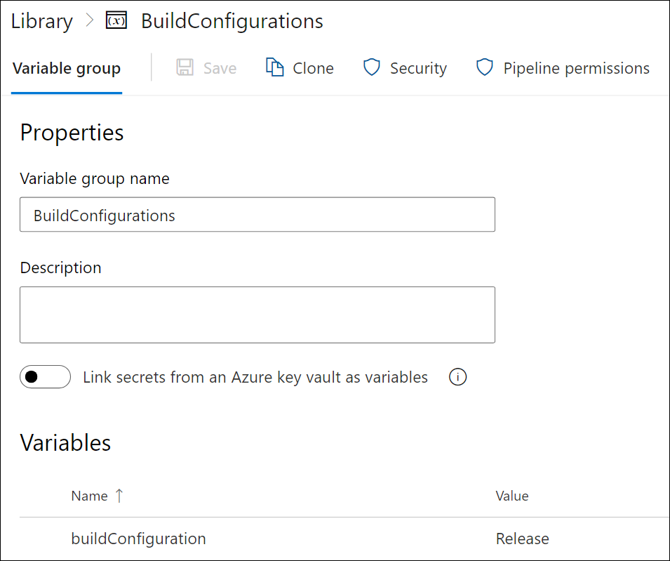

---
lab:
  title: Configuración de canalizaciones para usar variables y parámetros de forma segura
  module: 'Module 7: Configure pipelines to securely use variables and parameters'
---

# Configuración de canalizaciones para usar variables y parámetros de forma segura

En este laboratorio, aprenderá a configurar canalizaciones para usar de forma segura variables y parámetros.

Estos ejercicios duran aproximadamente **20** minutos.

## Antes de comenzar

Necesitará una suscripción de Azure, una organización de Azure DevOps y la aplicación eShopOnWeb para seguir los laboratorios.

- Siga los pasos para [validar el entorno de laboratorio](APL2001_M00_Validate_Lab_Environment.md).

## Instrucciones

### Ejercicio 1: Garantizar los tipos de parámetros y variables

#### Ejercicio 1: Importación y ejecución de la canalización de CI

Empiece por importar la canalización de CI denominada [eshoponweb-ci.yml](https://github.com/MicrosoftLearning/eShopOnWeb/blob/main/.ado/eshoponweb-ci.yml).

1. Vaya al portal de Azure DevOps en `https://dev.azure.com` y abra su organización.

1. Abra el proyecto eShopOnWeb.

1. Vaya a **Pipelines (Canalizaciones) > Pipelines (Canalizaciones)**.

1. Seleccione el botón **New Pipeline (Nueva canalización)**.

1. Seleccione **Git de Azure Repos (YAML)**.

1. Seleccione el repositorio **eShopOnWeb**.

1. Seleccione **Archivo YAML de Azure Pipelines existente**.

1. Seleccione el archivo **/.ado/eshoponweb-ci.yml** y seleccione **Continue (Continuar)**.

1. Haga clic en el botón **Run (Ejecutar)** para ejecutar la canalización.

1. La canalización tomará un nombre basado en el nombre del proyecto. Cámbielo para identificar mejor la canalización.

1. Vaya a **Pipelines (Canalizaciones) > Pipelines (Canalizaciones)** y seleccione la canalización creada recientemente. Seleccione los puntos suspensivos y la opción **Rename/move (Cambiar nombre/mover)**.

1. Asígnele el nombre **eshoponweb-ci-parameters** y seleccione **Save (Guardar)**.

#### Tarea 2: Garantizar tipos de parámetros para canalizaciones YAML

En esta tarea, establecerá los tipos de parámetro y parámetro para la canalización.

1. Vaya a **Pipelines (Canalizaciones) > Pipelines (Canalizaciones)** y seleccione la canalización **eshoponweb-ci-parameters**.

1. Seleccione **Edit (Editar)**.

1. Agregue los siguientes parámetros en la parte superior del archivo YAML:

    ```YAML
    parameters:
    - name: dotNetProjects
      type: string
      default: '**/*.sln'
    - name: testProjects
      type: string
      default: 'tests/UnitTests/*.csproj'

    resources:
      repositories:
      - repository: self
        trigger: none

    stages:
    - stage: Build
      displayName: Build .Net Core Solution
    ```

1. Reemplace las rutas de acceso codificadas de forma codificada en las tareas “Restaurar”, “Compilar” y “Probar” por los parámetros que acaba de crear.
   - **Reemplace proyectos**: '**/*.sln' por proyectos: ${{ parameters.dotNetProjects }} en las tareas “Restaurar” y “Compilar”.
   - **Reemplace proyectos**: "tests/UnitTests/*.csproj" por proyectos: ${{ parameters.testProjects }} en la tarea “Probar”.

    El archivo YAML debería tener este aspecto:

    ```YAML
        steps:
        - task: DotNetCoreCLI@2
          displayName: Restore
          inputs:
            command: 'restore'
            projects: ${{ parameters.dotNetProjects }}
            feedsToUse: 'select'
    
        - task: DotNetCoreCLI@2
          displayName: Build
          inputs:
            command: 'build'
            projects: ${{ parameters.dotNetProjects }}
    
        - task: DotNetCoreCLI@2
          displayName: Test
          inputs:
            command: 'test'
            projects: ${{ parameters.testProjects }}

    ```

1. Guarde la canalización y ejecútelo, debería ejecutarse correctamente.

    

#### Tarea 2: Protección de variables y parámetros

En esta tarea, protegerá las variables y los parámetros de la canalización mediante grupos de variables.

1. Vaya a **Pipelines (Canalizaciones) > Library (Biblioteca)**.

1. Seleccione el botón **+ Variable group (+ Grupo de variables)** para crear un grupo de variables. Asígnele un nombre como **BuildConfigurations**.

1. Agregue una variable denominada **buildConfiguration** y establezca su valor en `Release`.

1. Guarde el grupo de variables.

    

1. Seleccione el botón **Pipeline permissions (Permisos de canalización)** y, luego, el botón **+** para agregar una canalización.

1. Seleccione la canalización **eshoponweb-ci-parameters** para permitir que la canalización use el grupo de variables.

    

1. (Opcional) También puede establecer usuarios o grupos específicos para poder editar el grupo de variables haciendo clic en el botón **Security (Seguridad)**.

1. Vuelva al archivo YAML y, en la parte superior del archivo, justo debajo de los parámetros, haga referencia al grupo de variables agregando lo siguiente:

    ```YAML
    variables:
      - group: BuildConfigurations
    
    ```

1. En la tarea “Compilar”, reemplace el comando “build” por las líneas siguientes para usar la configuración de compilación del grupo de variables.

    ```YAML
    command: 'build'
    projects: ${{ parameters.dotNetProjects }}
    configuration: $(buildConfiguration)
    
    ```

1. Guarde y ejecute la canalización. Debe ejecutarse correctamente con la configuración de compilación establecida en `Release`. Para comprobarlo, examine los registros de la tarea “Compilar”.

Siguiendo este enfoque, puede proteger las variables y los parámetros mediante el uso de grupos de variables sin tener que codificarlos de forma difícil en el archivo YAML.

#### Tarea 3: Validación de variables y parámetros obligatorios

En esta tarea, validará las variables obligatorias antes de que se ejecute la canalización.

1. Vaya a **Pipelines (Canalizaciones) > Pipelines (Canalizaciones)**.

1. Abra la canalización **eshoponweb-ci-parameters** y seleccione **Edit (Editar)**.

1. Agregue una nueva fase como primera fase denominada **Validate (Validar)** para validar las variables obligatorias antes de que se ejecute la canalización.

    ```YAML
    - stage: Validate
      displayName: Validate mandatory variables
      jobs:
      - job: ValidateVariables
        pool:
          vmImage: ubuntu-latest
        steps:
        - script: |
            if [ -z "$(buildConfiguration)" ]; then
              echo "Error: buildConfiguration variable is not set"
              exit 1
            fi
          displayName: 'Validate Variables'
    
    ```

    > [!NOTE]
    > Esta fase ejecutará un script para validar la variable buildConfiguration. Si no se establece la variable, se producirá un error en el script y se detendrá la canalización.

1. Haga que la etapa de **compilación** dependa de la etapa de **validación** agregando dependsOn: Validate en la etapa de compilación:

    ```YAML
    - stage: Build
      displayName: Build .Net Core Solution
      dependsOn: Validate
    
    ```

1. Guarde y ejecute la canalización. Se ejecutará correctamente porque la variable buildConfiguration se establece en el grupo de variables.

1. Para probar la validación, quite la variable buildConfiguration del grupo de variables o elimine el grupo de variables y vuelva a ejecutar la canalización. No debería completarse y debería aparecer el siguiente error:

    Debería ver el siguiente error en los registros:

    ```YAML
    Error: buildConfiguration variable is not set
    
    ```

    

1. Vuelva a agregar el grupo de variables y la variable buildConfiguration al grupo de variables y vuelva a ejecutar la canalización. Debería ejecutarse correctamente.

## Revisar

En este laboratorio, aprenda a configurar canalizaciones para usar de forma segura variables y parámetros.
